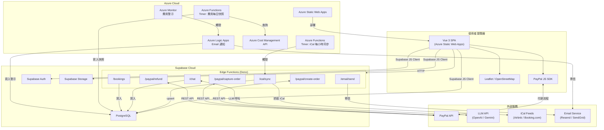
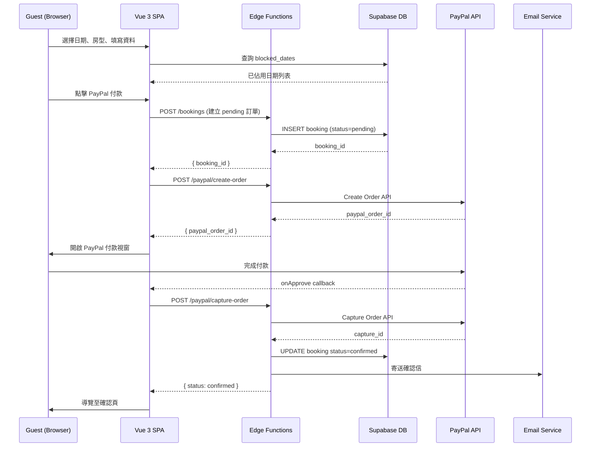
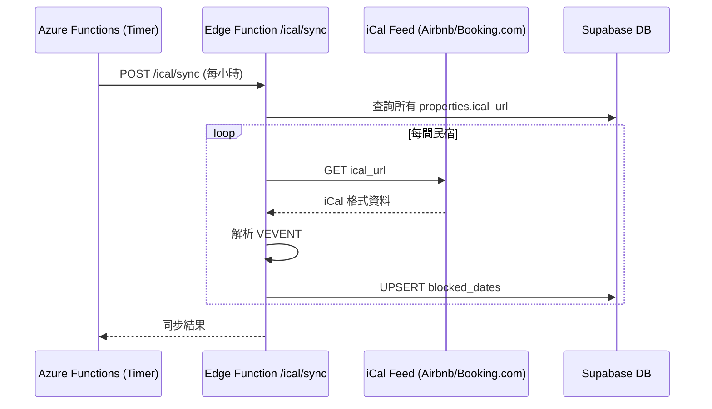
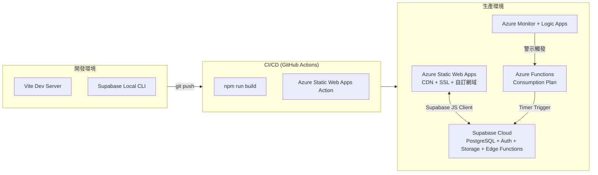

# 設計文件：Moment Chalet Hakuba 民宿預訂系統

## 概覽

本系統為「Moment Chalet Hakuba」民宿集團的線上預訂平台，涵蓋九間位於日本白馬村的民宿。系統採用 Vue 3 SPA 前端搭配 Supabase BaaS 後端，部署於 Azure Static Web Apps，提供旅客完整的瀏覽、預訂、付款、訂單查詢與退款流程，並配備後台管理介面供業者管理訂單、民宿資料、iCal 同步、Azure 費用監控及 AI 聊天機器人。

### 核心目標

- 提供流暢的三步驟預訂體驗（選日期/房型 → 填資料 → 付款）
- 透過 iCal 同步避免與 Airbnb / Booking.com 的雙重預訂
- 支援繁體中文、英文、日文三語系，完整 RWD
- 後台集中管理訂單、費用監控與 AI 機器人用量

---

## 架構

### 系統架構圖



### 技術選型

| 層級 | 技術 | 說明 |
|------|------|------|
| 前端框架 | Vue 3 + Vite | Composition API，快速開發體驗 |
| UI 元件庫 | Tailwind CSS + PrimeVue | 日系風格客製化 + 豐富元件 |
| 狀態管理 | Pinia | 輕量、TypeScript 友好 |
| 路由 | Vue Router 4 | SPA 路由管理 |
| 日曆 | v-calendar | 整合 blocked_dates 的日期選擇 |
| 地圖 | Leaflet + vue-leaflet | 免費、無需 API Key |
| 付款 | PayPal JS SDK | 直接載入 script |
| 多語系 | vue-i18n | zh-TW / en / ja |
| HTTP | axios | API 請求 |
| 後端 | Supabase | PostgreSQL + Auth + Storage + Edge Functions |
| 部署 | Azure Static Web Apps | CDN + 自訂網域 + SSL |
| 定時任務 | Azure Functions (Timer Trigger) | iCal 同步、費用快照 |
| 費用監控 | Azure Monitor + Logic Apps | 警示觸發與通知 |

---

## 元件與介面設計

### 前端路由結構

```
/                          → 首頁 (HomeView)
/properties                → 民宿列表頁 (PropertiesView)
/properties/:id            → 民宿詳情頁 (PropertyDetailView)
/booking                   → 預訂頁 (BookingView)
/booking/confirmation      → 訂單確認頁 (BookingConfirmationView)
/my-booking                → 訂單查詢頁 (MyBookingView)
/admin/login               → 後台登入 (AdminLoginView)
/admin                     → 後台首頁 (AdminDashboardView)
/admin/bookings            → 訂單管理 (AdminBookingsView)
/admin/properties          → 民宿管理 (AdminPropertiesView)
/admin/ical                → iCal 同步管理 (AdminIcalView)
/admin/costs               → Azure 費用監控 (AdminCostsView)
/admin/chatbot             → AI 機器人管理 (AdminChatbotView)
```

### Vue 元件樹

```mermaid
graph TD
    App --> Navbar
    App --> RouterView
    App --> ChatbotWidget
    App --> Footer

    RouterView --> HomeView
    RouterView --> PropertiesView
    RouterView --> PropertyDetailView
    RouterView --> BookingView
    RouterView --> BookingConfirmationView
    RouterView --> MyBookingView
    RouterView --> AdminLayout

    HomeView --> HeroBanner
    HomeView --> PropertyGrid
    HomeView --> PropertyMap
    HomeView --> TestimonialCarousel

    PropertiesView --> FilterBar
    PropertiesView --> PropertyCard
    PropertiesView --> PropertyMap

    PropertyDetailView --> ImageGallery
    PropertyDetailView --> RoomCard
    PropertyDetailView --> AmenitiesList
    PropertyDetailView --> PropertyMap

    BookingView --> StepIndicator
    BookingView --> DateRangePicker
    BookingView --> RoomCard
    BookingView --> GuestForm
    BookingView --> BookingSummary
    BookingView --> PayPalButton

    AdminLayout --> AdminSidebar
    AdminLayout --> AdminBookingsView
    AdminLayout --> AdminPropertiesView
    AdminLayout --> AdminIcalView
    AdminLayout --> AdminCostsView
    AdminLayout --> AdminChatbotView

    AdminBookingsView --> AdminTable
    AdminBookingsView --> StatusBadge
    AdminCostsView --> CostChart
    AdminCostsView --> BudgetProgressBar
```



### 核心元件規格

#### Navbar
```typescript
// props: 無
// emits: 無
// 功能：Logo、導覽連結、語言切換下拉（zh-TW / en / ja）
// 語言選擇儲存至 localStorage，切換後立即更新 vue-i18n locale
```

#### PropertyMap
```typescript
interface PropertyMapProps {
  mode: 'single' | 'multi'
  properties: Array<{ id: string; name: string; lat: number; lng: number; price?: number }>
  selectedId?: string
}
// 使用 vue-leaflet，multi 模式顯示多個 pin + 價格標籤
// single 模式顯示單點，支援縮放
// 點擊 pin emit 'select' 事件
```

#### DateRangePicker
```typescript
interface DateRangePickerProps {
  propertyId: string
  modelValue: { checkIn: Date | null; checkOut: Date | null }
}
// 載入時查詢 blocked_dates，將已佔用日期設為 disabled
// 退房日期不得早於或等於入住日期
// 依 locale 調整日期顯示格式
```

#### RoomCard
```typescript
interface RoomCardProps {
  roomType: RoomType
  hasBreakfastOption: boolean
  selected?: boolean
}
// emits: 'select', 'breakfast-change'
// 顯示圖片、名稱、容納人數、設施、每晚價格
// 若 hasBreakfastOption 為 true，顯示早餐 toggle
```

#### BookingSummary
```typescript
interface BookingSummaryProps {
  propertyName: string
  roomTypeName: string
  checkIn: Date
  checkOut: Date
  includeBreakfast: boolean
  pricePerNight: number
  breakfastPrice: number
}
// 計算總晚數、早餐費用、總金額（TWD）
```

#### PayPalButton
```typescript
interface PayPalButtonProps {
  amount: number
  currency: 'TWD'
  bookingData: BookingFormData
}
// emits: 'success', 'error', 'cancel'
// 呼叫 /paypal/create-order 取得 order ID
// 透過 PayPal JS SDK 渲染付款按鈕
```

#### StatusBadge
```typescript
type BookingStatus = 'pending' | 'confirmed' | 'cancelled' | 'refunded'
interface StatusBadgeProps {
  status: BookingStatus
}
// pending: 黃色、confirmed: 綠色、cancelled: 灰色、refunded: 藍色
```

#### AdminTable
```typescript
interface AdminTableProps {
  columns: Array<{ key: string; label: string; sortable?: boolean }>
  data: Record<string, unknown>[]
  loading?: boolean
}
// 通用後台資料表格，支援排序、分頁
```

#### ChatbotWidget
```typescript
// 固定在右下角，z-index 高於其他元素
// 點擊圓形按鈕展開/收合對話視窗
// 對話歷史存於 sessionStorage（key: 'chatbot_history'）
// 依目前 locale 自動設定 system prompt 語言
```

### Pinia Stores

#### usePropertyStore
```typescript
interface PropertyStore {
  properties: Property[]
  currentProperty: Property | null
  filters: { location: string; checkIn: Date | null; checkOut: Date | null; guests: number; priceRange: [number, number] }
  fetchProperties(): Promise<void>
  fetchPropertyById(id: string): Promise<void>
  applyFilters(): Property[]
}
```

#### useBookingStore
```typescript
interface BookingStore {
  step: 1 | 2 | 3
  selectedProperty: Property | null
  selectedRoomType: RoomType | null
  checkIn: Date | null
  checkOut: Date | null
  includeBreakfast: boolean
  guestName: string
  guestEmail: string
  guestPhone: string
  specialRequests: string
  totalAmount: number
  setStep(step: number): void
  calculateTotal(): number
  reset(): void
}
```

#### useAuthStore
```typescript
interface AuthStore {
  user: User | null
  isAdmin: boolean
  login(email: string, password: string): Promise<void>
  logout(): Promise<void>
  checkSession(): Promise<void>
}
```

#### useChatStore
```typescript
interface ChatStore {
  isOpen: boolean
  messages: Array<{ role: 'user' | 'assistant'; content: string; timestamp: Date }>
  isLoading: boolean
  sessionId: string
  sendMessage(content: string): Promise<void>
  toggleWidget(): void
  loadFromSession(): void
}
```

---

## 資料模型

### 資料庫 Schema（Supabase PostgreSQL）

#### properties（民宿）
```sql
CREATE TABLE properties (
  id                  UUID PRIMARY KEY DEFAULT gen_random_uuid(),
  name                TEXT NOT NULL,
  description         TEXT,
  location            TEXT NOT NULL,
  lat                 FLOAT NOT NULL,
  lng                 FLOAT NOT NULL,
  images              TEXT[] DEFAULT '{}',
  ical_url            TEXT,
  has_breakfast_option BOOLEAN DEFAULT FALSE,
  is_active           BOOLEAN DEFAULT TRUE,
  created_at          TIMESTAMPTZ DEFAULT NOW()
);
```

#### room_types（房型）
```sql
CREATE TABLE room_types (
  id              UUID PRIMARY KEY DEFAULT gen_random_uuid(),
  property_id     UUID NOT NULL REFERENCES properties(id) ON DELETE CASCADE,
  name            TEXT NOT NULL,
  capacity        INT NOT NULL,
  price_per_night NUMERIC(10, 2) NOT NULL,
  breakfast_price NUMERIC(10, 2) DEFAULT 0,
  amenities       TEXT[] DEFAULT '{}',
  images          TEXT[] DEFAULT '{}',
  is_active       BOOLEAN DEFAULT TRUE,
  created_at      TIMESTAMPTZ DEFAULT NOW()
);
```

#### bookings（訂單）
```sql
CREATE TABLE bookings (
  id                UUID PRIMARY KEY DEFAULT gen_random_uuid(),
  room_type_id      UUID NOT NULL REFERENCES room_types(id),
  guest_name        TEXT NOT NULL,
  guest_email       TEXT NOT NULL,
  guest_phone       TEXT NOT NULL,
  check_in          DATE NOT NULL,
  check_out         DATE NOT NULL,
  include_breakfast BOOLEAN DEFAULT FALSE,
  total_amount      NUMERIC(10, 2) NOT NULL,
  status            TEXT NOT NULL DEFAULT 'pending'
                    CHECK (status IN ('pending', 'confirmed', 'cancelled', 'refunded')),
  paypal_order_id   TEXT,
  paypal_capture_id TEXT,
  special_requests  TEXT,
  created_at        TIMESTAMPTZ DEFAULT NOW(),
  CONSTRAINT check_dates CHECK (check_out > check_in)
);
```

#### blocked_dates（已佔用日期）
```sql
CREATE TABLE blocked_dates (
  id          UUID PRIMARY KEY DEFAULT gen_random_uuid(),
  property_id UUID NOT NULL REFERENCES properties(id) ON DELETE CASCADE,
  start_date  DATE NOT NULL,
  end_date    DATE NOT NULL,
  source      TEXT NOT NULL CHECK (source IN ('ical', 'manual')),
  synced_at   TIMESTAMPTZ DEFAULT NOW(),
  CONSTRAINT check_blocked_dates CHECK (end_date >= start_date)
);

CREATE UNIQUE INDEX idx_blocked_dates_unique
  ON blocked_dates(property_id, start_date, end_date, source);
```

#### chat_logs（對話紀錄）
```sql
CREATE TABLE chat_logs (
  id          UUID PRIMARY KEY DEFAULT gen_random_uuid(),
  session_id  TEXT NOT NULL,
  role        TEXT NOT NULL CHECK (role IN ('user', 'assistant')),
  content     TEXT NOT NULL,
  tokens_used INT DEFAULT 0,
  created_at  TIMESTAMPTZ DEFAULT NOW()
);

CREATE INDEX idx_chat_logs_session ON chat_logs(session_id);
```

#### llm_usage_snapshots（LLM 用量快照）
```sql
CREATE TABLE llm_usage_snapshots (
  id             UUID PRIMARY KEY DEFAULT gen_random_uuid(),
  provider       TEXT NOT NULL,   -- openai | gemini
  model          TEXT NOT NULL,   -- gpt-4o | gemini-pro
  tokens_input   INT NOT NULL DEFAULT 0,
  tokens_output  INT NOT NULL DEFAULT 0,
  cost_usd       NUMERIC(10, 6) NOT NULL DEFAULT 0,
  created_at     TIMESTAMPTZ DEFAULT NOW()
);
```

#### azure_cost_snapshots（Azure 費用快照）
```sql
CREATE TABLE azure_cost_snapshots (
  id            UUID PRIMARY KEY DEFAULT gen_random_uuid(),
  snapshot_date DATE NOT NULL,
  service_name  TEXT NOT NULL,
  resource_name TEXT,
  cost_usd      NUMERIC(10, 4) NOT NULL DEFAULT 0,
  cost_twd      NUMERIC(10, 2) NOT NULL DEFAULT 0,
  period        TEXT NOT NULL CHECK (period IN ('daily', 'weekly', 'monthly')),
  created_at    TIMESTAMPTZ DEFAULT NOW()
);

CREATE INDEX idx_cost_snapshots_date ON azure_cost_snapshots(snapshot_date);
```

#### azure_alerts（Azure 費用警示）
```sql
CREATE TABLE azure_alerts (
  id              UUID PRIMARY KEY DEFAULT gen_random_uuid(),
  triggered_at    TIMESTAMPTZ NOT NULL DEFAULT NOW(),
  threshold_usd   NUMERIC(10, 2) NOT NULL,
  actual_cost_usd NUMERIC(10, 2) NOT NULL,
  message         TEXT,
  created_at      TIMESTAMPTZ DEFAULT NOW()
);
```

### Row Level Security（RLS）政策

```sql
-- properties: 公開讀取，僅 Admin 可寫
ALTER TABLE properties ENABLE ROW LEVEL SECURITY;
CREATE POLICY "public read properties" ON properties FOR SELECT USING (true);
CREATE POLICY "admin write properties" ON properties FOR ALL
  USING (auth.role() = 'authenticated');

-- bookings: 僅 Edge Function（service role）可寫，Admin 可讀全部
ALTER TABLE bookings ENABLE ROW LEVEL SECURITY;
CREATE POLICY "admin read bookings" ON bookings FOR SELECT
  USING (auth.role() = 'authenticated');

-- blocked_dates: 公開讀取
ALTER TABLE blocked_dates ENABLE ROW LEVEL SECURITY;
CREATE POLICY "public read blocked_dates" ON blocked_dates FOR SELECT USING (true);

-- chat_logs, llm_usage_snapshots, azure_*: 僅 Admin 可讀
ALTER TABLE chat_logs ENABLE ROW LEVEL SECURITY;
CREATE POLICY "admin read chat_logs" ON chat_logs FOR SELECT
  USING (auth.role() = 'authenticated');
```

### TypeScript 型別定義

```typescript
// src/types/index.ts

export interface Property {
  id: string
  name: string
  description: string
  location: string
  lat: number
  lng: number
  images: string[]
  ical_url: string | null
  has_breakfast_option: boolean
  is_active: boolean
  created_at: string
}

export interface RoomType {
  id: string
  property_id: string
  name: string
  capacity: number
  price_per_night: number
  breakfast_price: number
  amenities: string[]
  images: string[]
  is_active: boolean
  created_at: string
}

export interface Booking {
  id: string
  room_type_id: string
  guest_name: string
  guest_email: string
  guest_phone: string
  check_in: string   // ISO date string
  check_out: string  // ISO date string
  include_breakfast: boolean
  total_amount: number
  status: 'pending' | 'confirmed' | 'cancelled' | 'refunded'
  paypal_order_id: string | null
  paypal_capture_id: string | null
  special_requests: string | null
  created_at: string
}

export interface BlockedDate {
  id: string
  property_id: string
  start_date: string
  end_date: string
  source: 'ical' | 'manual'
  synced_at: string
}

export interface BookingFormData {
  room_type_id: string
  guest_name: string
  guest_email: string
  guest_phone: string
  check_in: string
  check_out: string
  include_breakfast: boolean
  total_amount: number
  special_requests?: string
}
```

---

## API 設計

### Supabase Edge Functions

#### POST /functions/v1/bookings
建立訂單（狀態為 `pending`）

Request:
```json
{
  "room_type_id": "uuid",
  "guest_name": "string",
  "guest_email": "string",
  "guest_phone": "string",
  "check_in": "YYYY-MM-DD",
  "check_out": "YYYY-MM-DD",
  "include_breakfast": false,
  "total_amount": 12000,
  "special_requests": "string | null"
}
```

Response `201`:
```json
{ "booking_id": "uuid" }
```

驗證邏輯：
1. 確認 `check_out > check_in`
2. 查詢 `blocked_dates` 確認日期未被佔用
3. 確認 `room_type_id` 存在且 `is_active = true`

---

#### POST /functions/v1/paypal/create-order
建立 PayPal 訂單

Request:
```json
{ "booking_id": "uuid", "amount": 12000, "currency": "TWD" }
```

Response `200`:
```json
{ "paypal_order_id": "string" }
```

---

#### POST /functions/v1/paypal/capture-order
捕捉 PayPal 付款，更新訂單狀態為 `confirmed`

Request:
```json
{ "booking_id": "uuid", "paypal_order_id": "string" }
```

Response `200`:
```json
{ "status": "confirmed", "paypal_capture_id": "string" }
```

副作用：
- 更新 `bookings.status = 'confirmed'`
- 記錄 `paypal_order_id`、`paypal_capture_id`
- 呼叫 `/email/send` 寄送確認信

---

#### POST /functions/v1/paypal/refund（需 Auth JWT）
執行 PayPal 退款

Request:
```json
{ "booking_id": "uuid", "paypal_capture_id": "string" }
```

Response `200`:
```json
{ "status": "refunded" }
```

副作用：
- 更新 `bookings.status = 'refunded'`
- 呼叫 `/email/send` 寄送退款通知信

---

#### POST /functions/v1/ical/sync（需 Auth JWT）
同步 iCal feed

Request:
```json
{ "property_id": "uuid | null" }
```
（`null` 表示同步全部）

Response `200`:
```json
{
  "synced": [{ "property_id": "uuid", "events_count": 5 }],
  "errors": [{ "property_id": "uuid", "error": "string" }]
}
```

---

#### POST /functions/v1/email/send
寄送 Email（內部呼叫）

Request:
```json
{
  "to": "guest@example.com",
  "template": "booking_confirmed | booking_refunded",
  "data": { "booking_id": "uuid", "guest_name": "string" }
}
```

---

#### POST /functions/v1/chat
AI 聊天機器人

Request:
```json
{
  "session_id": "string",
  "message": "string",
  "locale": "zh-TW | en | ja"
}
```

Response `200`:
```json
{ "reply": "string", "tokens_used": 150 }
```

副作用：
- 寫入 `chat_logs`（user + assistant 各一筆）
- 寫入 `llm_usage_snapshots`

---

### 資料流圖

#### 預訂流程



#### iCal 同步流程



---

## 部署架構



### 環境變數

| 變數名稱 | 說明 | 存放位置 |
|---------|------|---------|
| `VITE_SUPABASE_URL` | Supabase 專案 URL | Azure Static Web Apps Settings |
| `VITE_SUPABASE_ANON_KEY` | Supabase 匿名金鑰 | Azure Static Web Apps Settings |
| `SUPABASE_SERVICE_ROLE_KEY` | Edge Functions 服務金鑰 | Supabase Secrets |
| `PAYPAL_CLIENT_ID` | PayPal 應用程式 ID | Supabase Secrets |
| `PAYPAL_CLIENT_SECRET` | PayPal 應用程式密鑰 | Supabase Secrets |
| `LLM_API_KEY` | OpenAI / Gemini API Key | Supabase Secrets |
| `EMAIL_API_KEY` | Resend / SendGrid API Key | Supabase Secrets |
| `AZURE_SUBSCRIPTION_ID` | Azure 訂閱 ID | Azure Functions Settings |
| `AZURE_COST_API_TOKEN` | Azure Cost Management Token | Azure Key Vault |


---

## 正確性屬性

*屬性（Property）是在系統所有有效執行中都應成立的特性或行為，本質上是對系統應做什麼的形式化陳述。屬性作為人類可讀規格與機器可驗證正確性保證之間的橋樑。*

### 屬性 1：篩選結果一致性

*對任意* 民宿資料集合與篩選條件（地點、入住日期、退房日期、人數、價格區間），篩選後返回的所有民宿都應完全符合所有篩選條件，不應包含任何不符合條件的民宿。

**Validates: Requirements 1.2**

---

### 屬性 2：民宿詳情頁完整性

*對任意* 民宿資料，詳情頁渲染結果應包含民宿名稱、地址、簡介、至少一張圖片、房型列表、設施清單與地圖座標。

**Validates: Requirements 1.5**

---

### 屬性 3：房型卡片資訊完整性

*對任意* 房型資料，RoomCard 元件渲染結果應包含房型名稱、容納人數、設施清單與每晚價格。

**Validates: Requirements 2.1**

---

### 屬性 4：早餐選項顯示規則

*對任意* 民宿，當且僅當 `has_breakfast_option` 為 `true` 時，房型卡片上應顯示早餐切換選項；當 `has_breakfast_option` 為 `false` 時，不應顯示早餐選項。

**Validates: Requirements 2.2**

---

### 屬性 5：含早餐金額計算正確性

*對任意* 房型（每晚價格 P）、早餐費用（B）、住宿晚數（N）與早餐選擇（include_breakfast），總金額應滿足：
- 不含早餐：total = P × N
- 含早餐：total = (P + B) × N

**Validates: Requirements 2.3**

---

### 屬性 6：已佔用日期不可選

*對任意* `blocked_dates` 集合，DateRangePicker 中所有在該集合範圍內的日期應被標示為 disabled，且嘗試選擇這些日期應被系統拒絕。

**Validates: Requirements 3.2, 3.3**

---

### 屬性 7：日期順序驗證

*對任意* 入住日期（check_in）與退房日期（check_out），若 check_out ≤ check_in，系統應拒絕該日期組合並顯示錯誤提示。

**Validates: Requirements 3.4**

---

### 屬性 8：日期格式依語系調整

*對任意* 日期值與語系（zh-TW / en / ja），格式化後的日期字串應符合對應語系的格式規則：
- zh-TW：YYYY/MM/DD
- en：MM/DD/YYYY
- ja：YYYY年MM月DD日

**Validates: Requirements 3.5, 14.4**

---

### 屬性 9：步驟一完成條件

*對任意* 預訂流程狀態，當且僅當已選擇有效的入住日期、退房日期（check_out > check_in）且已選擇房型時，「下一步」按鈕應為啟用狀態。

**Validates: Requirements 4.2**

---

### 屬性 10：必填欄位驗證

*對任意* 步驟二表單提交，若旅客姓名、Email 或電話任一欄位為空或格式無效，系統應拒絕提交並顯示對應欄位的驗證錯誤訊息。

**Validates: Requirements 4.4**

---

### 屬性 11：訂單摘要資訊完整性

*對任意* 預訂資料，步驟三的訂單摘要應包含民宿名稱、房型名稱、入住日期、退房日期、早餐選項與總金額，且總金額應與屬性 5 的計算結果一致。

**Validates: Requirements 4.5**

---

### 屬性 12：付款確認後訂單狀態更新

*對任意* 成功的 PayPal capture 操作，訂單狀態應從 `pending` 更新為 `confirmed`，且 `paypal_order_id` 與 `paypal_capture_id` 應被正確記錄，並觸發確認 Email 寄送。

**Validates: Requirements 5.4, 5.5**

---

### 屬性 13：訂單確認頁資訊完整性

*對任意* confirmed 訂單，確認頁渲染結果應包含訂單編號、民宿名稱、房型名稱、入住日期、退房日期與總金額。

**Validates: Requirements 6.1**

---

### 屬性 14：訂單查詢正確性

*對任意* 有效的 email 與 booking_id 組合，查詢結果應返回對應訂單的正確狀態；對任意無效的組合，應返回「查無訂單」提示。

**Validates: Requirements 7.2, 7.3**

---

### 屬性 15：退款按鈕顯示條件

*對任意* 訂單，當且僅當訂單狀態為 `confirmed` 且在退款期限內時，應顯示「申請退款」按鈕；其他狀態或超過退款期限的訂單不應顯示退款按鈕。

**Validates: Requirements 7.4**

---

### 屬性 16：iCal 解析 Round-Trip

*對任意* 有效的 iCal feed，解析後的 VEVENT 日期範圍應正確 upsert 至 `blocked_dates` 資料表，且查詢 `blocked_dates` 應能取回與原始 iCal 事件對應的日期範圍。

**Validates: Requirements 8.2**

---

### 屬性 17：退款後訂單狀態更新

*對任意* 成功的 PayPal 退款操作，訂單狀態應從 `confirmed` 更新為 `refunded`，且應觸發退款通知 Email 寄送至旅客。

**Validates: Requirements 9.4**

---

### 屬性 18：後台訂單篩選一致性

*對任意* 訂單資料集合與狀態篩選條件，後台訂單列表返回的所有訂單都應符合篩選條件，不應包含其他狀態的訂單。

**Validates: Requirements 9.1**

---

### 屬性 19：民宿/房型 CRUD Round-Trip

*對任意* 民宿或房型資料，新增後查詢應能找到該筆資料；停用後查詢前台列表不應包含該筆資料；編輯後查詢應返回更新後的資料。

**Validates: Requirements 10.1, 10.2**

---

### 屬性 20：預算警示進度條顏色規則

*對任意* 當月累計費用（actual）與預算上限（budget），進度條顏色應滿足：
- actual / budget < 0.5：綠色
- 0.5 ≤ actual / budget < 0.8：黃色
- actual / budget ≥ 0.8：紅色

**Validates: Requirements 11.6**

---

### 屬性 21：Chatbot 依語系切換

*對任意* 語系設定（zh-TW / en / ja），傳送至 `/functions/v1/chat` 的請求應包含對應的 locale 參數，且機器人回覆應使用對應語言。

**Validates: Requirements 12.4, 14.6**

---

### 屬性 22：對話紀錄寫入完整性

*對任意* 一次完整的 Chatbot 對話（user 訊息 + assistant 回覆），`chat_logs` 資料表應包含對應 session_id 的兩筆紀錄（role: user 與 role: assistant），且 `llm_usage_snapshots` 應包含對應的用量快照。

**Validates: Requirements 12.5, 13.1**

---

### 屬性 23：對話歷史 sessionStorage Round-Trip

*對任意* 對話序列，將訊息存入 sessionStorage 後再讀取，應得到與原始序列相同的對話歷史（順序、內容、role 均一致）。

**Validates: Requirements 12.6**

---

### 屬性 24：語系切換持久化

*對任意* 語系選擇，切換後 localStorage 中應儲存對應的語系值，且重新載入頁面後應自動套用該語系。

**Validates: Requirements 14.3**

---

### 屬性 25：貨幣顯示格式

*對任意* 金額數值，前台顯示應包含 TWD 標示，且金額格式應為正整數或最多兩位小數。

**Validates: Requirements 14.5**

---

### 屬性 26：頁面 Meta 資訊完整性

*對任意* 前台頁面，渲染後的 HTML 應包含非空的 `<title>` 標籤與 `<meta name="description">` 標籤，且不同頁面的 title 應不同。

**Validates: Requirements 15.2**

---

### 屬性 27：圖片 Alt 文字完整性

*對任意* 頁面中的 `` 元素，應具有非空的 `alt` 屬性。

**Validates: Requirements 15.3**

---

## 錯誤處理

### 前端錯誤處理策略

| 錯誤情境 | 處理方式 |
|---------|---------|
| Supabase 查詢失敗 | 顯示 toast 錯誤訊息，提供重試按鈕 |
| PayPal create-order 失敗 | 顯示錯誤訊息，允許重試 |
| PayPal capture-order 失敗 | 顯示錯誤訊息，訂單保持 pending 狀態，提供客服聯絡資訊 |
| 表單驗證失敗 | 欄位下方顯示紅色錯誤提示文字 |
| 日期選擇衝突 | DateRangePicker 內顯示提示訊息 |
| 網路連線中斷 | 全域 axios interceptor 顯示連線錯誤 toast |
| 訂單查無結果 | 顯示「查無訂單」提示，建議確認輸入資訊 |
| Chatbot API 失敗 | 顯示「暫時無法回覆，請稍後再試」 |

### 後端錯誤處理策略

| 錯誤情境 | 處理方式 |
|---------|---------|
| iCal feed 無法存取 | 記錄錯誤至 DB，後台顯示錯誤狀態，不中斷其他民宿同步 |
| iCal 解析失敗 | 記錄錯誤訊息，保留上次成功的 blocked_dates |
| PayPal API 錯誤 | 返回 4xx/5xx 錯誤碼與錯誤訊息，前端顯示對應提示 |
| LLM API 超時 | 返回 504，前端顯示重試提示 |
| Email 寄送失敗 | 記錄錯誤，不影響訂單狀態，可手動重寄 |
| Azure Cost API 失敗 | 記錄錯誤，保留上次快照資料，後台顯示資料更新時間 |
| 日期衝突（並發預訂） | Edge Function 使用 DB transaction 檢查，返回 409 Conflict |

### HTTP 狀態碼規範

| 狀態碼 | 使用情境 |
|--------|---------|
| 200 | 成功 |
| 201 | 資源建立成功（訂單建立） |
| 400 | 請求參數錯誤（日期格式、必填欄位缺失） |
| 401 | 未授權（需要 Admin JWT） |
| 404 | 資源不存在（訂單查無） |
| 409 | 衝突（日期已被佔用） |
| 500 | 伺服器內部錯誤 |
| 502 | 外部 API 錯誤（PayPal / LLM） |

---

## 測試策略

### 雙軌測試方法

本系統採用單元測試與屬性測試並行的策略，兩者互補以達到全面覆蓋：

- **單元測試**：驗證特定例子、邊緣案例與錯誤條件
- **屬性測試**：驗證對所有輸入都成立的通用屬性

### 測試工具選型

| 測試類型 | 工具 | 說明 |
|---------|------|------|
| 單元測試 | Vitest | Vue 3 + Vite 生態系，速度快 |
| 元件測試 | @vue/test-utils + Vitest | Vue 元件渲染與互動測試 |
| 屬性測試 | fast-check | TypeScript 友好的 PBT 函式庫 |
| E2E 測試 | Playwright | 完整預訂流程端對端測試 |
| API 測試 | Vitest + msw | Mock Service Worker 模擬 Edge Functions |

### 屬性測試配置

每個屬性測試應執行最少 **100 次迭代**（fast-check 預設為 100）。

每個屬性測試必須以以下格式標記：

```typescript
// Feature: moment-chalet-booking-system, Property {N}: {property_text}
```

範例：

```typescript
// Feature: moment-chalet-booking-system, Property 5: 含早餐金額計算正確性
import fc from 'fast-check'
import { describe, it, expect } from 'vitest'
import { calculateTotal } from '@/utils/booking'

describe('Property 5: 含早餐金額計算正確性', () => {
  it('不含早餐：total = price × nights', () => {
    fc.assert(
      fc.property(
        fc.float({ min: 1000, max: 50000 }),  // price_per_night
        fc.integer({ min: 1, max: 30 }),       // nights
        (price, nights) => {
          const total = calculateTotal({ price, nights, includeBreakfast: false, breakfastPrice: 0 })
          return Math.abs(total - price * nights) < 0.01
        }
      ),
      { numRuns: 100 }
    )
  })

  it('含早餐：total = (price + breakfast) × nights', () => {
    fc.assert(
      fc.property(
        fc.float({ min: 1000, max: 50000 }),  // price_per_night
        fc.float({ min: 0, max: 5000 }),       // breakfast_price
        fc.integer({ min: 1, max: 30 }),       // nights
        (price, breakfast, nights) => {
          const total = calculateTotal({ price, nights, includeBreakfast: true, breakfastPrice: breakfast })
          return Math.abs(total - (price + breakfast) * nights) < 0.01
        }
      ),
      { numRuns: 100 }
    )
  })
})
```

### 屬性測試對應表

| 屬性 | 測試類型 | 測試描述 |
|------|---------|---------|
| 屬性 1 | property | 生成隨機民宿資料與篩選條件，驗證結果一致性 |
| 屬性 2 | property | 生成隨機民宿資料，驗證詳情頁渲染完整性 |
| 屬性 3 | property | 生成隨機房型資料，驗證 RoomCard 渲染完整性 |
| 屬性 4 | property | 生成隨機 has_breakfast_option 值，驗證早餐選項顯示規則 |
| 屬性 5 | property | 生成隨機價格、晚數、早餐選擇，驗證金額計算 |
| 屬性 6 | property | 生成隨機 blocked_dates，驗證日曆 disabled 狀態 |
| 屬性 7 | property | 生成隨機日期組合，驗證日期順序驗證邏輯 |
| 屬性 8 | property | 生成隨機日期，驗證三種語系格式化結果 |
| 屬性 9 | property | 生成隨機預訂狀態，驗證下一步按鈕啟用條件 |
| 屬性 10 | property | 生成隨機表單資料（含缺失欄位），驗證驗證邏輯 |
| 屬性 11 | property | 生成隨機預訂資料，驗證摘要完整性與金額一致性 |
| 屬性 12 | example | Mock PayPal capture 成功，驗證訂單狀態更新 |
| 屬性 13 | property | 生成隨機訂單資料，驗證確認頁渲染完整性 |
| 屬性 14 | property | 生成隨機 email/booking_id 組合，驗證查詢結果 |
| 屬性 15 | property | 生成隨機訂單狀態與日期，驗證退款按鈕顯示條件 |
| 屬性 16 | property | 生成隨機 iCal VEVENT，驗證解析 round-trip |
| 屬性 17 | example | Mock PayPal refund 成功，驗證訂單狀態更新 |
| 屬性 18 | property | 生成隨機訂單集合與篩選條件，驗證篩選一致性 |
| 屬性 19 | property | 生成隨機民宿/房型資料，驗證 CRUD round-trip |
| 屬性 20 | property | 生成隨機費用與預算值，驗證進度條顏色規則 |
| 屬性 21 | property | 生成隨機 locale，驗證 chat 請求包含正確語系 |
| 屬性 22 | property | 生成隨機對話，驗證 chat_logs 與 llm_usage_snapshots 寫入 |
| 屬性 23 | property | 生成隨機對話序列，驗證 sessionStorage round-trip |
| 屬性 24 | property | 生成隨機語系選擇，驗證 localStorage 持久化 |
| 屬性 25 | property | 生成隨機金額，驗證 TWD 格式顯示 |
| 屬性 26 | property | 對每個路由，驗證 title 與 meta description 非空且唯一 |
| 屬性 27 | property | 生成隨機圖片資料，驗證 alt 屬性非空 |

### 單元測試重點

單元測試應聚焦於以下特定例子與邊緣案例：

**邊緣案例**：
- PayPal 付款流程中途取消（5.6）
- iCal feed 無法存取（8.4）
- 訂單查無結果（7.3）
- PayPal 退款失敗（9.5）
- 並發預訂日期衝突（409 Conflict）
- 空的 iCal feed（0 個 VEVENT）
- 超長旅客姓名、特殊字元輸入

**整合點**：
- Supabase JS Client 查詢 blocked_dates
- PayPal JS SDK 與 Edge Function 的互動
- vue-i18n locale 切換與 localStorage 同步
- Pinia store 狀態與 Vue 元件的響應式連動

### E2E 測試場景

使用 Playwright 測試以下完整流程：

1. **完整預訂流程**：首頁 → 民宿詳情 → 預訂頁三步驟 → PayPal 付款（沙盒）→ 確認頁
2. **訂單查詢流程**：訂單查詢頁 → 輸入 email + booking_id → 查看訂單狀態
3. **後台退款流程**：後台登入 → 訂單管理 → 選擇訂單 → 執行退款
4. **語系切換流程**：切換語系 → 驗證頁面文字更新 → 重新載入驗證持久化
5. **Chatbot 對話流程**：點擊 Chatbot 按鈕 → 傳送訊息 → 驗證回覆顯示
