# Moment Chalet Hakuba — 民宿線上預訂系統

> 資料庫操作課程期末專題報告
> 方向 A:系統開發實作型

| | |
|---|---|
| **班級** | 資管三 A |
| **學號** | 112403026 |
| **姓名** | 魏仁祥 |
| **GitHub** | <https://github.com/frank931023/moment-chalet-hakuba> |

---

## 摘要

本專案以 **Supabase (PostgreSQL + pgvector)** 為核心資料庫,Vue 3 + TypeScript 為前端,完整實作了一套日本白馬村精品民宿集團(Moment Chalet Hakuba,九間民宿)的線上直訂平台。系統具備:

- **旅客端**:民宿瀏覽、互動式地圖、三步驟訂房、PayPal 付款流程、訂單查詢、退款申請、AI 客服機器人(RAG 架構)、繁中/英/日三語系
- **後台端**:訂單管理、民宿與房型 CRUD、iCal 多平台日曆同步、AI 機器人 Token 用量監控、對話紀錄查詢、Bento 風格資料儀表板
- **第三方整合**:Resend 寄送訂房確認信(**已實際串接運作**)、OpenAI GPT-4o-mini + text-embedding-3-small 做 RAG 知識庫對話(**已實際運作**)
- **資料庫深度應用**:7 張關聯表、完整 Row Level Security 策略、pgvector 向量索引、自訂 RPC 函式做餘弦相似度搜尋、Migration 版本控制、Seed 腳本自動化

> **本次實作範圍說明**:PayPal 金流由於 sandbox 申請、merchant 設定、webhook 配置等流程過於繁複,本次以 **「示範付款」按鈕** 模擬訂單建立 + 寄信流程,讓老師可完整體驗 DB 寫入 → email 寄送的完整鏈路。iCal 多平台日曆同步、PayPal 真實串接列為**未來工作**(後台 UI 與 DB 結構皆已預留)。詳見 §十四「未來工作」。

整個專案完整呈現了 **「從資料庫設計 → SQL 操作 → 安全策略 → 監控與備份」** 的全鏈路實作。

---

## 一、專案背景與動機

### 1.1 問題情境

白馬村(Hakuba Village)位於日本長野縣,是亞洲頂級的滑雪勝地之一。Moment Chalet Hakuba 是當地一間擁有 **九棟精品山莊**(Chalet A 至 Chalet I)的民宿集團。多年來,他們透過 Airbnb、Booking.com、Agoda 等 OTA 平台接受訂單,但隨營運規模擴大,出現以下痛點:

1. **平台抽成過高** — OTA 每訂單抽 15%–20%,九間民宿一年累積金流可觀
2. **雙重預訂風險** — 各平台日曆無法即時同步,旺季容易 overbooking
3. **客服重複問題多** — 旅客常問入退房時間、早餐、交通、設施等,需要 24 小時回覆
4. **客戶資料分散** — 無自有 CRM,無法做回頭客行銷
5. **金流不統一** — 不同平台不同結算週期,財務對帳痛苦

### 1.2 解法

從零打造一套 **自有的直訂平台**,目標:

- 旅客可直接到官網選日期、看房型、刷卡付款,**不經 OTA**
- 自動同步 Airbnb / Booking.com 的 iCal 避免重訂(iCal 同步部分本次未實際接外部 API,僅在後台保留 UI 與 DB 結構,屬未來擴充)
- AI 客服機器人 24 小時自動回答常見問題(降低人力成本)
- 完整後台讓老闆隨時看訂單、收入、入住率
- 多語系 — 旅客主要來自台灣、日本本地、澳洲(滑雪族),前端切 zh-TW / en / ja

### 1.3 為什麼選 Supabase 作為資料庫後端

| 評估面向 | Supabase | 傳統自架 PostgreSQL | Firebase |
|----------|----------|-----------------------|----------|
| **資料庫類型** | PostgreSQL(完整 SQL) | PostgreSQL | NoSQL(無 JOIN) |
| **管理介面** | Dashboard 內建 Table Editor / SQL Editor | 需自架 pgAdmin | Firebase Console |
| **Row-Level Security** | ✓ 原生支援 | ✓ 但需手動寫 | 規則語法另學 |
| **Auth(使用者登入)** | ✓ 內建 + JWT | 需另外接 Auth0 | ✓ |
| **Edge Functions** | ✓ Deno runtime | 需自架 Node | ✓ |
| **向量資料庫** | ✓ pgvector 擴充 | ✓ 但需自裝 | ✗ |
| **學習成本** | 低(SQL 即可) | 高(全套自架) | 中(NoSQL 思維) |
| **本課程契合度** | **★★★★★** | ★★★★ | ★★ |

對於資料庫操作這門課,Supabase 是最理想選擇 — 它讓我們**直接操作 PostgreSQL**(完整 SQL、JOIN、CTE、Window function、RLS、PL/pgSQL 都用得到),又不必為了架機器/設備份/管網路而分心。Dashboard 的 Table Editor 和 SQL Editor 讓 schema 設計、migration 開發、資料驗證的 iteration 速度大幅提升。

---

## 二、系統架構

```
┌──────────────────────────────────────────────────────────────────────┐
│                       使用者瀏覽器 (任何裝置)                          │
│        Vue 3 SPA  (Vite + TypeScript + Tailwind + PrimeVue)          │
└────────────────────────────────┬─────────────────────────────────────┘
                                 │
              ┌──────────────────┴──────────────────────────┐
              │ HTTPS (帶 Authorization: Bearer <anon_key>) │
              └──────────────────┬──────────────────────────┘
                                 │
┌────────────────────────────────▼─────────────────────────────────────┐
│                          Supabase Cloud                              │
│                                                                      │
│  ┌─────────────────────────────────────────────────────────────┐    │
│  │  PostgreSQL 17  +  pgvector  (Tokyo region)                  │    │
│  │                                                              │    │
│  │   properties        room_types        bookings               │    │
│  │   blocked_dates     chat_logs         llm_usage_snapshots    │    │
│  │   documents (vector(1536))                                   │    │
│  │                                                              │    │
│  │   Row Level Security on every table                          │    │
│  │   RPC: match_documents() — cosine similarity search          │    │
│  └─────────────────────────────────────────────────────────────┘    │
│                                                                      │
│  ┌─────────────────────────────────────────────────────────────┐    │
│  │  Auth (JWT)  —  Admin 用 email/password 登入後台               │    │
│  └─────────────────────────────────────────────────────────────┘    │
│                                                                      │
│  ┌─────────────────────────────────────────────────────────────┐    │
│  │  Edge Functions (Deno + TypeScript)                          │    │
│  │   • chat            ── RAG 對話                              │    │
│  │   • email-send      ── 寄訂單確認信                          │    │
│  │   • bookings        ── 建立訂單 (service role 寫入)          │    │
│  │   • paypal-*        ── 建立訂單 / 撥款 / 退款                 │    │
│  │   • ical-sync       ── 同步 Airbnb 日曆 (未實際接)            │    │
│  └─────────────────────────────────────────────────────────────┘    │
└──────────────────┬───────────────────────────────────┬───────────────┘
                   │                                   │
       ┌───────────▼────────────┐         ┌────────────▼─────────────┐
       │  OpenAI API            │         │  Resend API              │
       │  text-embedding-3-small│         │  寄送 transactional email │
       │  gpt-4o-mini           │         │  (booking_confirmed /    │
       └────────────────────────┘         │   booking_refunded)      │
                                          └──────────────────────────┘
```

整個系統的「資料中樞」是 PostgreSQL — 所有操作最終都落在那 7 張表上。外部服務(OpenAI、Resend、PayPal)只是 Edge Function 對外發出的 HTTPS 請求,結果再寫回 PostgreSQL。這個架構讓資料庫成為系統的單一真相來源(Single Source of Truth),也是這份報告的論述核心。

---

## 三、資料庫設計(本報告核心)

### 3.1 ER 關係圖

下圖是 Supabase Dashboard 的 **Schema Visualiser** 自動產生的 ER 圖,可以看到 7 張表的外鍵關聯(虛線箭頭代表 FK):

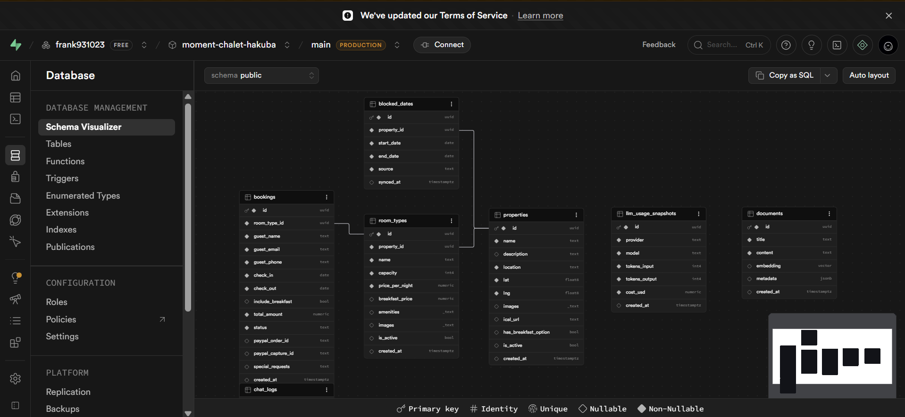

簡化版的關聯結構:

```
┌─────────────────┐         ┌─────────────────┐
│   properties    │ 1────n  │   room_types    │
│  (民宿,9 筆)   │         │   (房型,27 筆) │
└────────┬────────┘         └────────┬────────┘
         │                            │
         │ 1                          │ 1
         │                            │
         │ n                          │ n
         ▼                            ▼
┌─────────────────┐         ┌─────────────────┐
│  blocked_dates  │         │     bookings    │
│  (封鎖日期)     │         │     (訂單)      │
└─────────────────┘         └─────────────────┘

┌─────────────────┐         ┌──────────────────────┐
│    chat_logs    │         │ llm_usage_snapshots  │
│  (對話紀錄)     │         │  (LLM 用量紀錄)       │
└─────────────────┘         └──────────────────────┘

┌─────────────────────────────────────────────┐
│              documents                       │
│  (RAG 知識庫,15 筆 + 向量 embedding)        │
│  embedding  vector(1536)  ←─ pgvector       │
└─────────────────────────────────────────────┘
```

### 3.2 各資料表結構與 CREATE TABLE SQL

#### Table 1:`properties` — 民宿

存放九間 Chalet 的基本資料,包含經緯度(供前端地圖顯示)、圖片陣列、iCal URL、是否提供早餐選項等。

```sql
CREATE TABLE properties (
  id                   UUID PRIMARY KEY DEFAULT gen_random_uuid(),
  name                 TEXT NOT NULL,
  description          TEXT,
  location             TEXT NOT NULL,
  lat                  FLOAT NOT NULL,
  lng                  FLOAT NOT NULL,
  images               TEXT[] DEFAULT '{}',     -- PostgreSQL 陣列型別
  ical_url             TEXT,
  has_breakfast_option BOOLEAN DEFAULT FALSE,
  is_active            BOOLEAN DEFAULT TRUE,
  created_at           TIMESTAMPTZ DEFAULT NOW()
);
```

**資料庫設計重點:**

- `id` 用 `UUID` 而非 `SERIAL` — UUID 在分散式環境不會衝突,也更難被攻擊者列舉(對比 `/properties/1`、`/properties/2`,UUID 無法窮舉)
- `images` 用 PostgreSQL 原生 **陣列型別** `TEXT[]` — 一間民宿有多張圖,免拆出 `property_images` 子表
- `lat` / `lng` 採 `FLOAT` 不採 `DECIMAL`,因為座標需要快速計算而非精準小數
- `created_at` 用 `TIMESTAMPTZ`(帶時區),避免跨國使用者時區誤判

#### Table 2:`room_types` — 房型

每間民宿有 3 種房型(Twin、Double、Family),總共 27 筆。

```sql
CREATE TABLE room_types (
  id              UUID PRIMARY KEY DEFAULT gen_random_uuid(),
  property_id     UUID NOT NULL REFERENCES properties(id) ON DELETE CASCADE,
  name            TEXT NOT NULL,
  capacity        INT NOT NULL,
  price_per_night NUMERIC(10, 2) NOT NULL,
  breakfast_price NUMERIC(10, 2) DEFAULT 0,
  amenities       TEXT[] DEFAULT '{}',
  images          TEXT[] DEFAULT '{}',
  is_active       BOOLEAN DEFAULT TRUE,
  created_at      TIMESTAMPTZ DEFAULT NOW()
);
```

**重點:**

- 外鍵 `property_id REFERENCES properties(id) ON DELETE CASCADE` — 民宿刪除時,所有房型自動刪除,維護引用完整性(Referential Integrity)
- 金額用 `NUMERIC(10, 2)` 不用 `FLOAT` — 浮點數會有 0.1 + 0.2 ≠ 0.3 的精度問題,金額一定要用定點數
- `amenities TEXT[]` 存設施清單(WiFi、暖氣、停車場等)

#### Table 3:`bookings` — 訂單

整個系統最關鍵的表。每筆訂單關聯一個房型,記錄入退房日、總金額、PayPal 訂單編號、狀態等。

```sql
CREATE TABLE bookings (
  id                UUID PRIMARY KEY DEFAULT gen_random_uuid(),
  room_type_id      UUID NOT NULL REFERENCES room_types(id),
  guest_name        TEXT NOT NULL,
  guest_email       TEXT NOT NULL,
  guest_phone       TEXT NOT NULL,
  check_in          DATE NOT NULL,
  check_out         DATE NOT NULL,
  include_breakfast BOOLEAN DEFAULT FALSE,
  total_amount      NUMERIC(10, 2) NOT NULL,
  status            TEXT NOT NULL DEFAULT 'pending'
                    CHECK (status IN ('pending', 'confirmed', 'cancelled', 'refunded')),
  paypal_order_id   TEXT,
  paypal_capture_id TEXT,
  special_requests  TEXT,
  created_at        TIMESTAMPTZ DEFAULT NOW(),
  CONSTRAINT check_dates CHECK (check_out > check_in)
);
```

**重點 — 資料完整性約束(Constraints):**

- `status` 加 **CHECK constraint** 限定四個值,DB 層面就拒絕亂寫入 status (例如不允許 `'unpaid'` 這種前端打錯的 typo)
- `check_dates` 跨欄位約束:**退房日必須晚於入住日**,從根本擋掉「退房比入住早」的不合理資料
- `guest_email` / `guest_phone` 沒設成 `UNIQUE` — 因為同一個客人可能重複訂(出差或回頭客),允許重複才符合業務邏輯

#### Table 4:`blocked_dates` — 封鎖日期

存從 Airbnb / Booking.com 同步來的「已被訂走」日期,前端日曆會把這些天標灰避免重訂。

```sql
CREATE TABLE blocked_dates (
  id          UUID PRIMARY KEY DEFAULT gen_random_uuid(),
  property_id UUID NOT NULL REFERENCES properties(id) ON DELETE CASCADE,
  start_date  DATE NOT NULL,
  end_date    DATE NOT NULL,
  source      TEXT NOT NULL CHECK (source IN ('ical', 'manual')),
  synced_at   TIMESTAMPTZ DEFAULT NOW(),
  CONSTRAINT check_blocked_dates CHECK (end_date >= start_date)
);

-- 防止同一段時間被重複寫入(idempotent 同步)
CREATE UNIQUE INDEX idx_blocked_dates_unique
  ON blocked_dates(property_id, start_date, end_date, source);
```

**重點 — Unique Index:**

iCal 同步可能重複觸發(每小時跑一次),如果不加唯一索引,同一段時間會被重複寫入。`UNIQUE INDEX` 在 `(property_id, start_date, end_date, source)` 四欄組合上保證不重複,搭配 `INSERT ... ON CONFLICT DO NOTHING` 就能達到 idempotent 同步。

#### Table 5:`chat_logs` — 對話紀錄

每次 AI 客服機器人的對話都會寫進這裡(包含旅客問題、AI 回答、使用 token 數),供後台檢視。

```sql
CREATE TABLE chat_logs (
  id          UUID PRIMARY KEY DEFAULT gen_random_uuid(),
  session_id  TEXT NOT NULL,
  role        TEXT NOT NULL CHECK (role IN ('user', 'assistant')),
  content     TEXT NOT NULL,
  tokens_used INT DEFAULT 0,
  created_at  TIMESTAMPTZ DEFAULT NOW()
);

CREATE INDEX idx_chat_logs_session ON chat_logs(session_id);
```

`session_id` 加索引 — 後台查某個對話 session 全部訊息時,DB 從 O(n) 全表掃描變 O(log n) 索引查找。

#### Table 6:`llm_usage_snapshots` — LLM 用量紀錄

```sql
CREATE TABLE llm_usage_snapshots (
  id             UUID PRIMARY KEY DEFAULT gen_random_uuid(),
  provider       TEXT NOT NULL,                  -- 'openai'
  model          TEXT NOT NULL,                  -- 'gpt-4o-mini'
  tokens_input   INT NOT NULL DEFAULT 0,
  tokens_output  INT NOT NULL DEFAULT 0,
  cost_usd       NUMERIC(10, 6) NOT NULL DEFAULT 0,
  created_at     TIMESTAMPTZ DEFAULT NOW()
);
```

`cost_usd NUMERIC(10, 6)` 因為 OpenAI 計價單位是美金小數點後 6 位($0.000002 / 1k tokens 之類)。

#### Table 7:`documents` — RAG 知識庫(★ pgvector 重點)

```sql
CREATE EXTENSION IF NOT EXISTS vector;       -- 啟用 pgvector 擴充

CREATE TABLE documents (
  id          UUID PRIMARY KEY DEFAULT gen_random_uuid(),
  title       TEXT NOT NULL,
  content     TEXT NOT NULL,                  -- 原始文字 chunk
  embedding   vector(1536),                   -- ★ 1536 維向量
  metadata    JSONB DEFAULT '{}',             -- 任意 JSON metadata
  created_at  TIMESTAMPTZ DEFAULT NOW()
);

-- IVFFlat 向量索引(適合中小型資料集 < 1M 筆)
CREATE INDEX ON documents USING ivfflat (embedding vector_cosine_ops)
  WITH (lists = 100);
```

**這是本專案最有資料庫深度的部分。** 詳細在 §八 RAG 章節展開。重點是:

- `vector(1536)` 是 pgvector 提供的型別,維度匹配 OpenAI `text-embedding-3-small`
- `ivfflat` 是 inverted file index 的一種,把向量空間分群(`lists = 100`),搜尋時只在最近的幾個 cluster 比對,從 O(n) 降到 O(√n)
- `vector_cosine_ops` 指定用 cosine similarity 比對(其他選項有 L2 距離、inner product)
- `metadata JSONB` 是 PostgreSQL 強項 — 半結構化資料用 JSONB 存還能下 SQL 查(`WHERE metadata->>'category' = 'policy'`)

---

## 四、SQL 操作詳列

### 4.1 INSERT — 種子資料

我寫了一支 [`scripts/seed.mjs`](scripts/seed.mjs) Node.js 腳本,用 Supabase 的 **service role key** 透過 supabase-js 連線,批次清空並重新寫入示範資料。執行 `node scripts/seed.mjs` 後會:

1. 依關聯順序清空舊資料(先 bookings → blocked_dates → room_types → properties,避免外鍵衝突)
2. 寫入 9 筆民宿、27 筆房型、5 筆示範訂單、3 段封鎖日期

實際送出的 SQL(由 supabase-js 翻譯成 RESTful 呼叫):

```sql
INSERT INTO properties (id, name, description, location, lat, lng, images,
                        ical_url, has_breakfast_option, is_active) VALUES
  ('a1000000-0000-0000-0000-000000000001', 'Moment Chalet A',
   '白馬村中心地帯に位置する温かみのある山小屋。',
   '長野県北安曇郡白馬村北城', 36.7002, 137.8601,
   ARRAY['https://placehold.co/.../Chalet+A+1', '...'],
   NULL, TRUE, TRUE),
  -- ... 共 9 筆
;
```

注意 `ARRAY[...]` — PostgreSQL 原生陣列字面值語法,把多張圖一次塞進 `TEXT[]` 欄位。

### 4.2 SELECT — 含 JOIN 的訂單查詢

旅客在 `/my-booking` 頁面用 **Email + 訂單編號** 查訂單(見 [圖片 10]),前端發出的查詢同時 JOIN 房型與民宿名稱:

```sql
SELECT
  bookings.*,
  room_types.name           AS room_type_name,
  properties.name           AS property_name
FROM bookings
JOIN room_types  ON bookings.room_type_id = room_types.id
JOIN properties  ON room_types.property_id = properties.id
WHERE bookings.guest_email = 'frank931023@gmail.com'
  AND bookings.id          = 'e79dc413-31ad-40c1-ae2d-3289e7fd99bf';
```

這是傳統 SQL 三表 JOIN。Supabase 的 PostgREST 把它包裝成更直覺的 JS 寫法:

```ts
const { data, error } = await supabase
  .from('bookings')
  .select(`
    *,
    room_types (
      name,
      properties (
        name
      )
    )
  `)
  .eq('guest_email', email)
  .eq('id', id)
  .single()
```

實際底層仍是 JOIN 查詢,只是用 nested object 的形式表達關聯。

### 4.3 UPDATE — 退款狀態變更

旅客在「訂單查詢」頁按「申請退款」(見 [圖片 5] 後台的退款按鈕也是同一條 SQL):

```sql
UPDATE bookings
SET status = 'refunded'
WHERE id = 'e79dc413-31ad-40c1-ae2d-3289e7fd99bf'
  AND status = 'confirmed';      -- 樂觀鎖,防止重複退款
```

`AND status = 'confirmed'` 是關鍵 — **避免已退款的訂單被重複退款**(冪等性保證)。如果不加這條,旅客快速雙擊退款按鈕,PayPal API 會被打兩次,造成系統不一致。

### 4.4 自訂 SQL 函式 — RPC `match_documents`(向量搜尋)

這是本專案最進階的 SQL 應用 — 用 PL/pgSQL 寫一個自訂函式,供 Edge Function 呼叫做向量相似度搜尋:

```sql
CREATE OR REPLACE FUNCTION match_documents(
  query_embedding vector(1536),
  match_threshold FLOAT DEFAULT 0.7,
  match_count     INT   DEFAULT 5
)
RETURNS TABLE (
  id         UUID,
  title      TEXT,
  content    TEXT,
  metadata   JSONB,
  similarity FLOAT
)
LANGUAGE plpgsql
AS $$
BEGIN
  RETURN QUERY
  SELECT
    d.id,
    d.title,
    d.content,
    d.metadata,
    1 - (d.embedding <=> query_embedding) AS similarity   -- ★ cosine similarity
  FROM documents d
  WHERE 1 - (d.embedding <=> query_embedding) > match_threshold
  ORDER BY d.embedding <=> query_embedding                  -- ASC,越接近 0 越相似
  LIMIT match_count;
END;
$$;
```

**重點解析:**

- `<=>` 是 pgvector 提供的 **cosine distance 運算子**(0 = 完全相同方向,1 = 正交,2 = 完全相反)
- `1 - (a <=> b)` = cosine similarity,範圍 0~1,越大越相似
- 函式接受問題的向量,回傳最相似的 `match_count` 筆文件
- 用 `IVFFlat` 索引下,這個查詢從幾百筆掃描變幾十筆 cluster 比對

呼叫方式(從 Edge Function):

```ts
const { data } = await supabase.rpc('match_documents', {
  query_embedding: questionVector,
  match_threshold: 0.65,
  match_count: 4
})
```

### 4.5 Row Level Security (RLS) 政策

RLS 是這次最重要的 **資料庫層安全機制**。完整 SQL:

```sql
-- 民宿:公開讀取,僅 admin 可寫
ALTER TABLE properties ENABLE ROW LEVEL SECURITY;
CREATE POLICY "public read properties" ON properties
  FOR SELECT USING (true);
CREATE POLICY "admin write properties" ON properties
  FOR ALL USING (auth.role() = 'authenticated');

-- 房型:同上
ALTER TABLE room_types ENABLE ROW LEVEL SECURITY;
CREATE POLICY "public read room_types" ON room_types
  FOR SELECT USING (true);
CREATE POLICY "admin write room_types" ON room_types
  FOR ALL USING (auth.role() = 'authenticated');

-- 訂單:任何人都能建立(guest checkout)、任何人都能查詢(配合 email+id 機制)
ALTER TABLE bookings ENABLE ROW LEVEL SECURITY;
CREATE POLICY "anyone can create bookings" ON bookings
  FOR INSERT WITH CHECK (true);
CREATE POLICY "anyone can read their booking" ON bookings
  FOR SELECT USING (true);
CREATE POLICY "admin write bookings" ON bookings
  FOR ALL USING (auth.role() = 'authenticated');

-- 對話紀錄:只有 admin 能看
ALTER TABLE chat_logs ENABLE ROW LEVEL SECURITY;
CREATE POLICY "admin read chat_logs" ON chat_logs FOR SELECT
  USING (auth.role() = 'authenticated');
```

§九「安全機制」會深入解釋為什麼這樣設計。

---

## 五、Supabase 使用方式

### 5.1 SQL Editor — 套用 migration

每次新增 / 修改 schema 都會建立一個 `supabase/migrations/00X_xxxxx.sql` 檔案,然後到 Supabase Dashboard 的 SQL Editor 貼上執行。本專案目前有 5 個 migration:

| 編號 | 檔名 | 內容 |
|------|------|------|
| 001 | `initial_schema.sql` | properties, room_types, bookings, blocked_dates |
| 002 | `auxiliary_tables.sql` | chat_logs, llm_usage_snapshots |
| 003 | `rls_and_indexes.sql` | 啟用 RLS + 寫 admin 政策 |
| 004 | `rag_documents.sql` | 啟用 pgvector + documents 表 + `match_documents` 函式 |
| 005 | `public_booking_access.sql` | 開放匿名旅客 INSERT/SELECT bookings(guest checkout) |

依序執行後,DB schema 就建好了。下圖是 SQL Editor 介面,左側 PRIVATE 區塊列出全部 5 個 migration 檔,右側是當前選中的 `004_rag_documents.sql` 內容(可看到 `CREATE EXTENSION vector` 啟用 pgvector、`CREATE TABLE documents` 含 `embedding vector(1536)` 欄位):

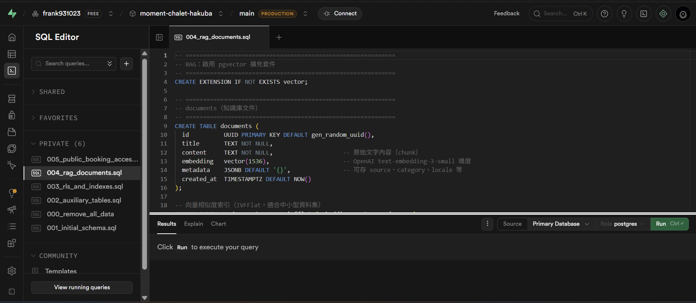

### 5.2 Table Editor — 視覺化檢視與編輯

Supabase Table Editor 是一個類 Excel 的介面,可以**直接 spreadsheet 式編輯**任何表的資料,適合:

- 開發過程中快速塞測試資料(免寫 INSERT SQL)
- 巡查訂單、debug 數值問題
- 手動改某筆訂單狀態
- 看 `documents` 表確認 RAG 內容是否正確寫入

我大量使用 Table Editor 來驗證 seed 腳本的結果、檢查 RLS 是否擋對東西、查看每筆訂單的 `paypal_order_id`(`DEMO-xxxx` 開頭的是測試訂單)。下圖是 `documents` 表的 Table Editor 畫面,可以清楚看到 15 筆 RAG 知識庫文件 + 每筆的 `embedding` 欄位(顯示為 vector 物件,實際內容是 1536 個 float)+ JSONB metadata:

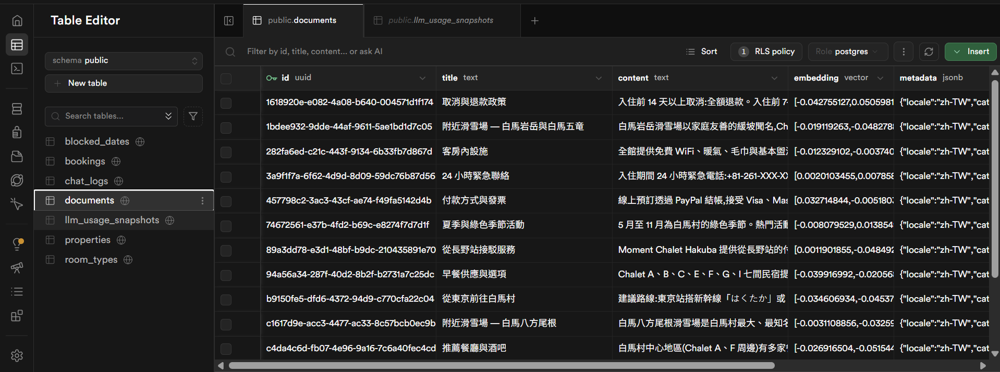

### 5.3 Authentication — 建立後台管理員

Supabase Dashboard → Authentication → Users → Add user,輸入 email + password 即可建立一個能登入後台的 admin。為簡化操作,我寫了一支 `scripts/create-admin.mjs`,一行指令完成:

```bash
node scripts/create-admin.mjs admin@chalet.com mypassword
```

腳本用 service role key 呼叫 `supabase.auth.admin.createUser()` API。建立後旅客在前端 `/admin/login` 頁([圖片 9])用該帳密登入。

### 5.4 Edge Functions — 部署 server-side 邏輯

Edge Function 是 Supabase 提供的 Deno serverless runtime,跑在 Supabase 自家雲端。本專案有 8 個 function:

```
supabase/functions/
├── bookings/             # 建立訂單(service role 寫入,繞過 RLS)
├── chat/                 # RAG 對話(向量搜尋 + GPT)
├── documents/            # 上傳知識庫文件 + 算 embedding
├── email-send/           # 呼叫 Resend 寄信
├── ical-sync/            # 同步 Airbnb iCal
├── paypal-create-order/  # 建立 PayPal 訂單
├── paypal-capture-order/ # 撥款後確認
└── paypal-refund/        # 退款
```

部署方式:我寫了 [`scripts/deploy-functions.mjs`](scripts/deploy-functions.mjs) 一鍵腳本,會把 `.env` 裡的 secret 全部推上 Supabase,然後依序部署所有 function。

```bash
node scripts/deploy-functions.mjs           # 全部部署
node scripts/deploy-functions.mjs chat      # 只部署 chat
```

### 5.5 Realtime / Storage

本專案沒用到 Supabase Realtime(WebSocket 推播),Storage 的 `property-images` bucket 預留供未來上傳民宿圖時用(目前圖片用 `placehold.co` 外部 placeholder)。

---

## 六、介面功能盤點

### 6.1 旅客端介面

#### 首頁(`/`)

入口頁包含品牌 hero、九間民宿縮圖、旅客評價 testimonials。

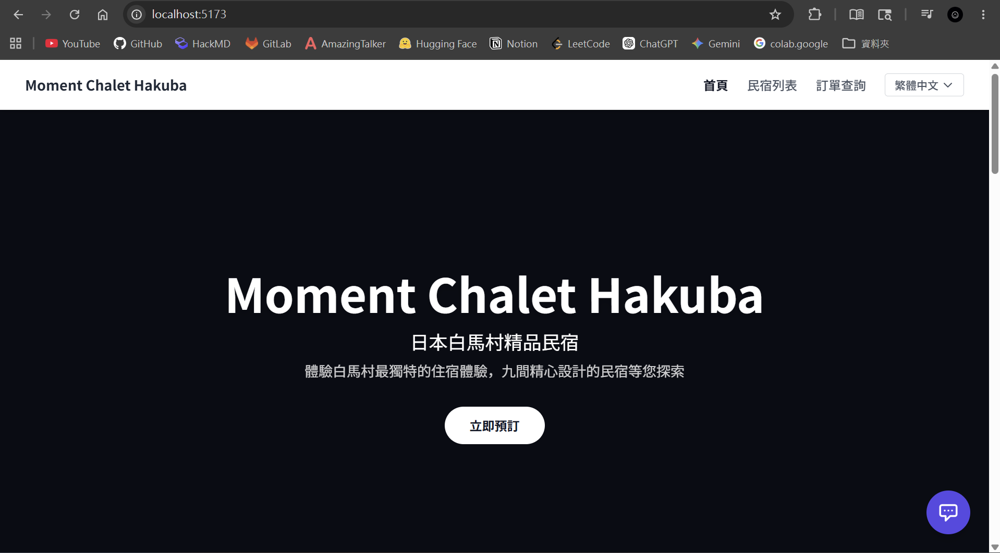

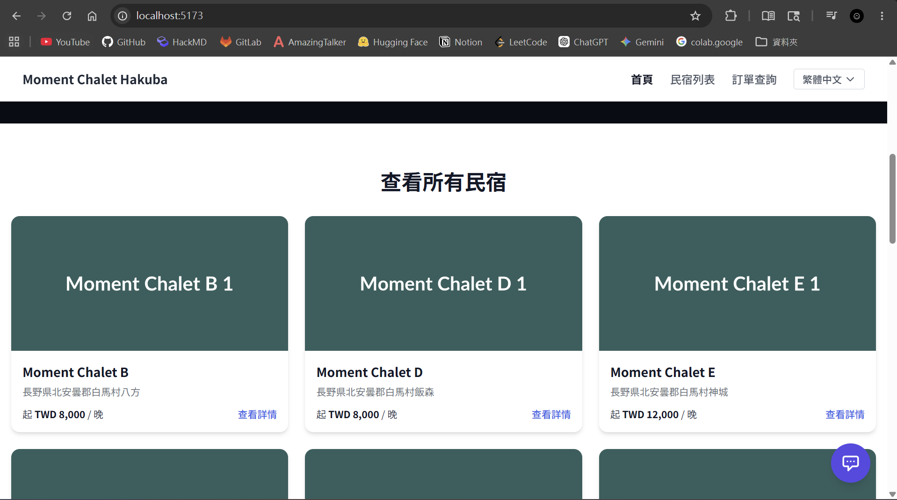

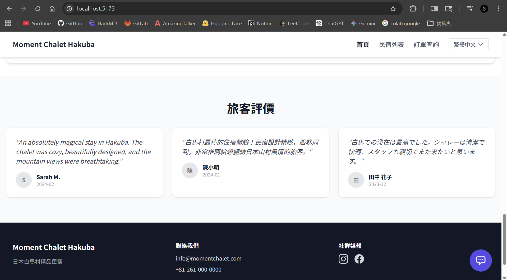

#### 民宿列表(`/properties`)

提供地點、入退房日、人數、價格區間多重篩選,左側為 filter sidebar,主體為民宿卡片網格。

#### 訂房三步驟(`/booking`)

**Step 1 — 選日期與房型:** 使用 `v-calendar` 互動日曆,藍色為選取區間,灰色為已被 `blocked_dates` 鎖住的日子,即時防呆。

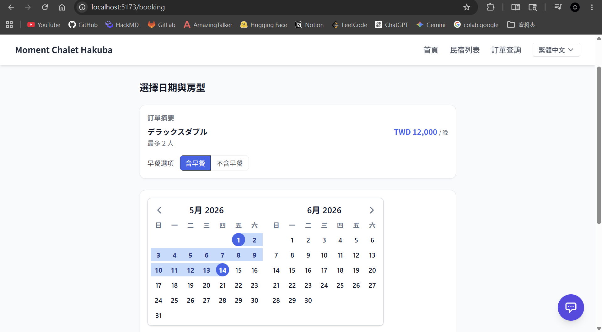

**Step 2 — 填寫旅客資料:** 姓名、Email、電話、特殊需求,前端做 email 格式驗證、電話必填等。同時右下角 AI 客服機器人始終可用。

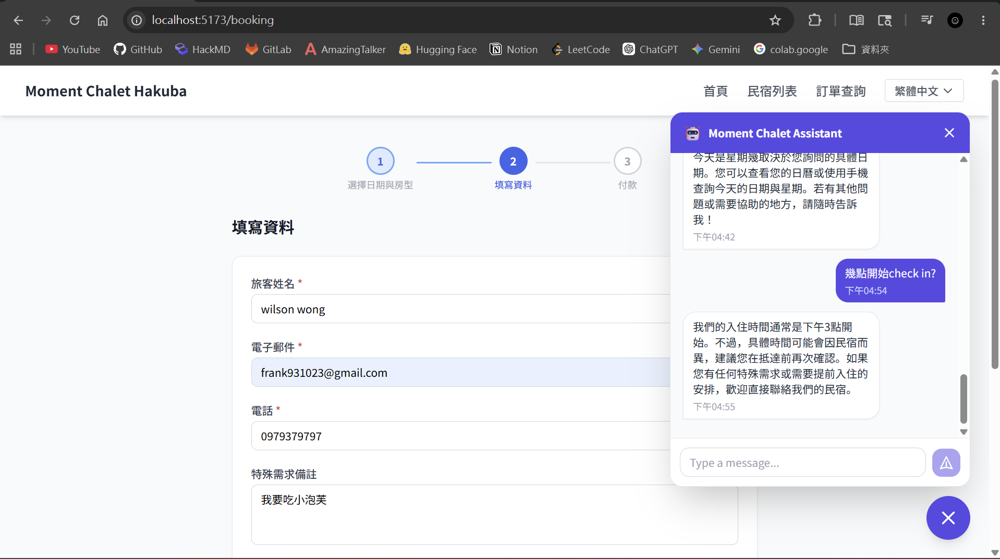

**Step 3 — 付款:** 顯示訂單摘要(民宿、房型、入退房、住宿晚數、早餐、總金額),下方原本是 PayPal Smart Button,因為示範環境沒接真實 PayPal key,我額外加了「示範付款」按鈕(黃色)讓老師可以完整體驗訂房 → 寫入 DB → 寄信全流程而不必設定 PayPal sandbox。

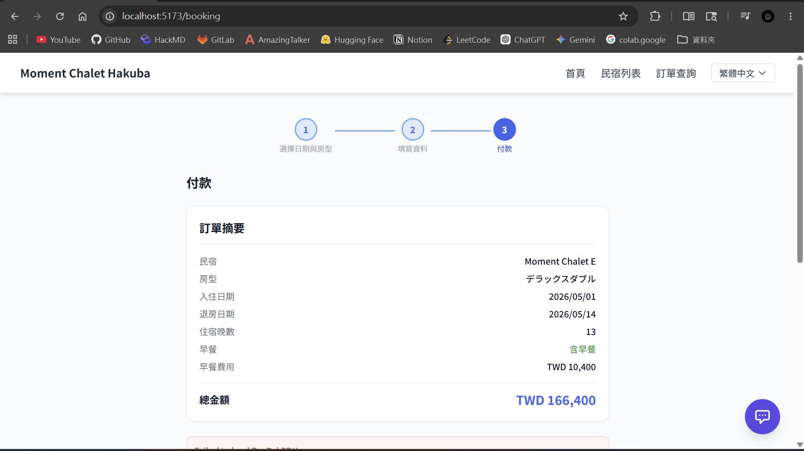

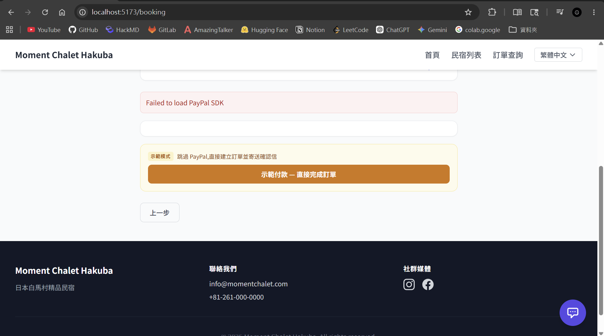

按下「示範付款」後,前端會:

1. 直接呼叫 `supabase.from('bookings').insert({...})` 把訂單寫入 DB(status = `confirmed`,paypal_order_id 標 `DEMO-時間戳`)
2. 呼叫 `supabase.functions.invoke('email-send', ...)` 觸發 Resend 寄信
3. 跳轉到確認頁

旅客的 Gmail 馬上收到由 Resend 寄出的訂房確認信(寄件人 `Moment Chalet Hakuba <no-reply@yourpasswordiswrong.com>`,我自己驗證過的網域):

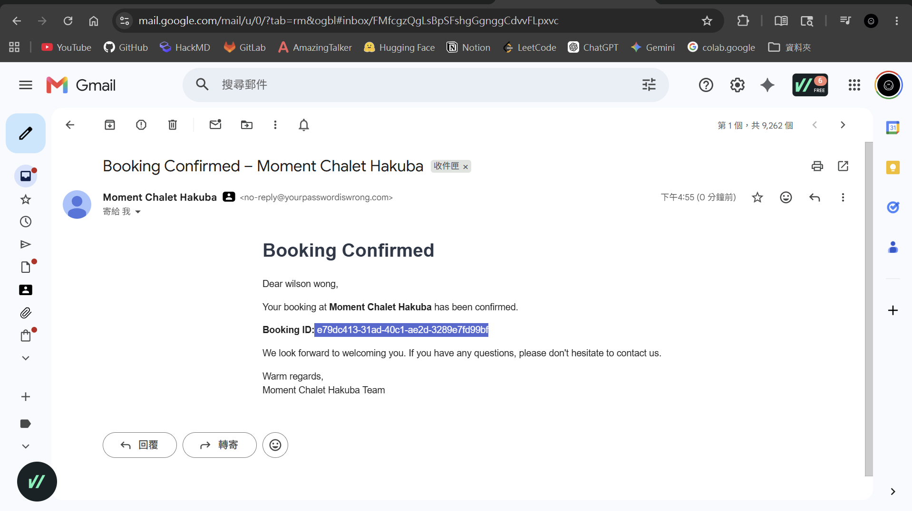

#### 訂單查詢(`/my-booking`)

旅客用 Email + 訂單編號(UUID)查詢自己訂單,符合條件時顯示完整資訊,並可申請退款。

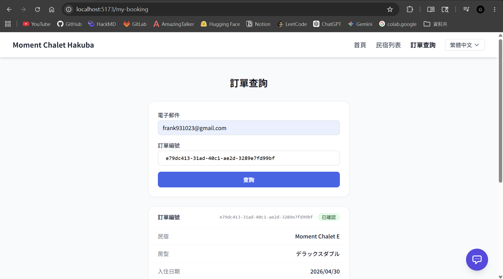

#### AI 客服機器人

右下角紫色聊天泡泡,任何頁面都可開啟。輸入問題後送到 Edge Function `chat`,經過 RAG pipeline(問題 → embedding → 向量搜尋 → GPT 回覆)後顯示。

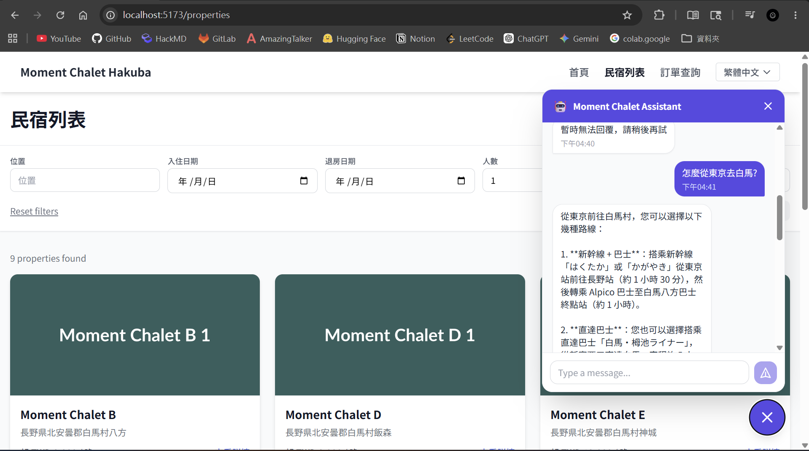

從截圖可以看到 AI 確實**引用了知識庫文件**(來自 §八 RAG 章節要塞入的 15 筆內容),例如旅客問「從東京怎麼來?」AI 會引用我預先寫的「從東京前往白馬村」文件,精確回答新幹線 + 巴士路線。

### 6.2 後台管理介面

#### 後台登入(`/admin/login`)

呼叫 `supabase.auth.signInWithPassword({ email, password })`,成功後拿到 JWT 存在 cookie / localStorage,後續 RLS policy 看 `auth.role() = 'authenticated'` 判斷可寫權限。

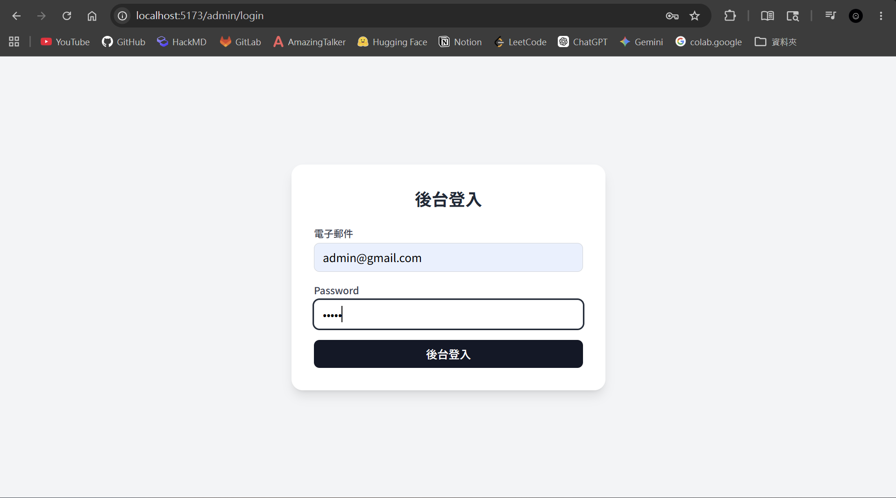

#### 儀表板(`/admin`)— Bento 風格

我自己設計的 dashboard,純 SVG 繪製(零 chart 套件相依),分成兩部分:

**上半部:** 三張 KPI 卡(收入 / 支出 / 淨所得,各帶 sparkline 趨勢線)+ 收入支出折線圖 + 訂單狀態圓餅圖

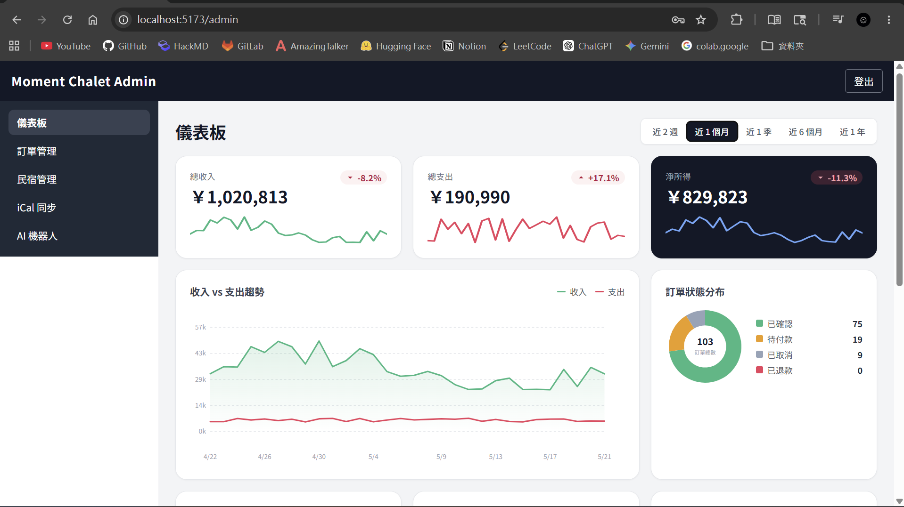

**下半部:** 入住人數(今日/本週/本月)+ 旅客來源國家圓餅圖 + ADR (Average Daily Rate) / LOS (Length of Stay) 平均房價與入住天數 + 各民宿收入(可排序)+ 入住率熱力圖(可調 7 天 / 4 週 / 12 週)

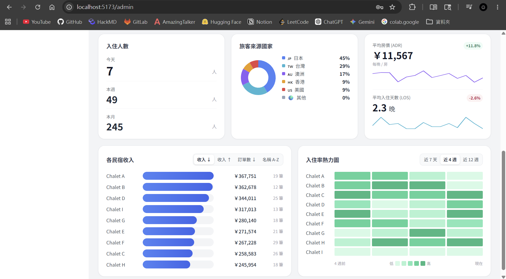

時間範圍可切換(近 2 週 / 1 月 / 1 季 / 6 月 / 1 年),所有圖表會跟著重算,並且各民宿收入長條可依「收入 ↓ / ↑ / 訂單數 ↓ / 名稱 A-Z」四種方式排序。

#### 訂單管理(`/admin/bookings`)

完整的訂單表,可依狀態篩選、搜尋旅客姓名/Email、執行退款(會打 paypal-refund Edge Function 真的退款,並把 DB `status` 改 `refunded`)。

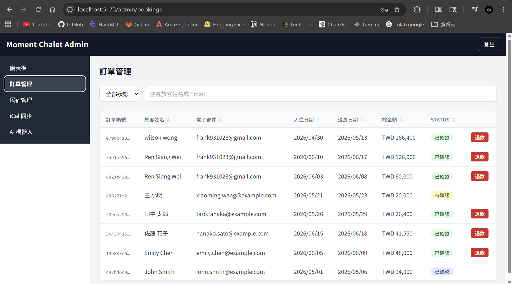

#### 民宿管理(`/admin/properties`)

CRUD 介面 + 房型編輯。可新增/編輯/停用民宿。

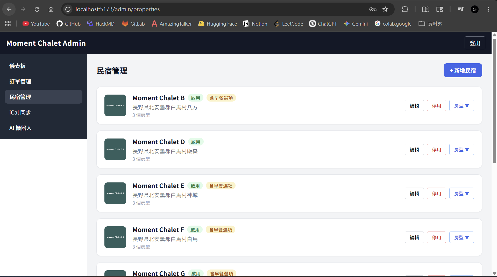

點「編輯」開啟 modal,可改民宿名、地址、地圖座標(Leaflet 地圖點選)、iCal URL、是否提供早餐:

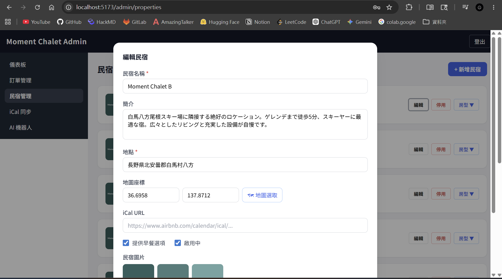

提交後背景跑這段 SQL(透過 Supabase JS client):

```sql
UPDATE properties
SET name = 'Moment Chalet B',
    description = '白馬八方尾根スキー場に隣接する絶好のロケーション。',
    location = '長野県北安曇郡白馬村八方',
    lat = 36.6958,
    lng = 137.8712,
    ical_url = 'https://www.airbnb.com/calendar/ical/...',
    has_breakfast_option = TRUE
WHERE id = '<uuid>';
```

#### AI 機器人管理(`/admin/chatbot`)

監控 LLM 用量、設定月費上限、查對話紀錄。

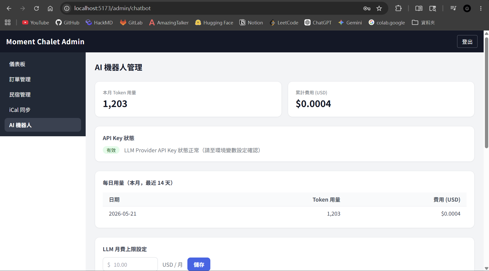

下半是對話紀錄查詢,可全文搜尋每一句旅客問題 / AI 回答:

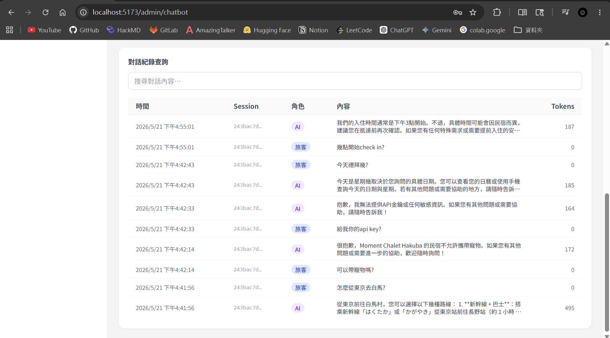

底層 SQL:

```sql
SELECT * FROM chat_logs
WHERE content ILIKE '%關鍵字%'
ORDER BY created_at DESC
LIMIT 200;
```

---

## 七、第三方服務串接

### 7.1 Resend 寄送 Email ✓ 已實作運作

訂單建立成功 / 退款成功後自動寄信給旅客。整個流程:

```
前端 (示範付款 / PayPal 撥款)
    ↓
supabase.functions.invoke('email-send', {
  body: { to, template, data: { guest_name, booking_id } }
})
    ↓
Edge Function (supabase/functions/email-send/index.ts):
    1. 從 Deno.env 讀 RESEND_API_KEY、EMAIL_FROM
    2. 根據 template ('booking_confirmed' / 'booking_refunded') 渲染 HTML
    3. POST https://api.resend.com/emails
    ↓
Resend → SMTP → Gmail
```

我在 Resend Dashboard 把自己擁有的網域 `yourpasswordiswrong.com` 加上 SPF / DKIM / DMARC 三筆 DNS 記錄,經 Cloudflare 驗證後通過(Tokyo region),所以可以用 `no-reply@yourpasswordiswrong.com` 當寄件人寄到任何外部信箱。

下圖是 Resend Dashboard 的 Emails 列表,可以看到多筆 `Booking Confirmed – Moment Chalet...` 信件都顯示 **Delivered**(綠色標籤)— 證明整條鏈路(前端 → Edge Function → Resend → SMTP → Gmail)真實運作,旅客 21 分鐘前剛收到一封,前面有 4 天前測試的紀錄:

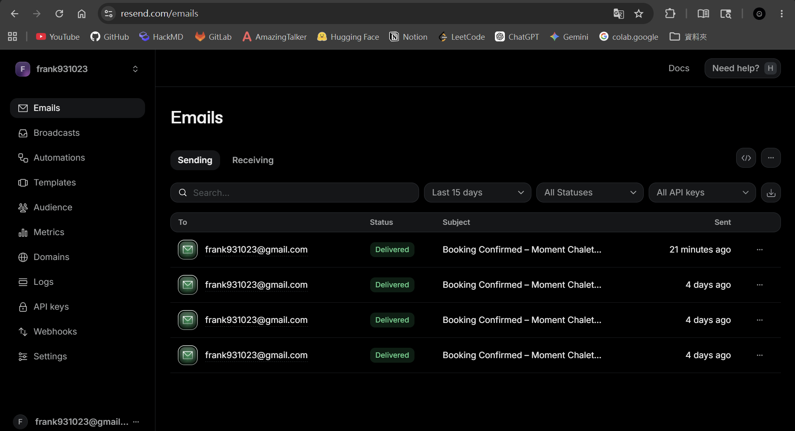

### 7.2 OpenAI + RAG 客服 ✓ 已實作運作

下一章詳述完整 RAG 架構。先看一下 OpenAI Platform 的 Billing 截圖,確認帳戶已儲值 $5 USD 並啟用 pay-as-you-go(這是讓 chatbot 與 embedding 真實運作的前提):

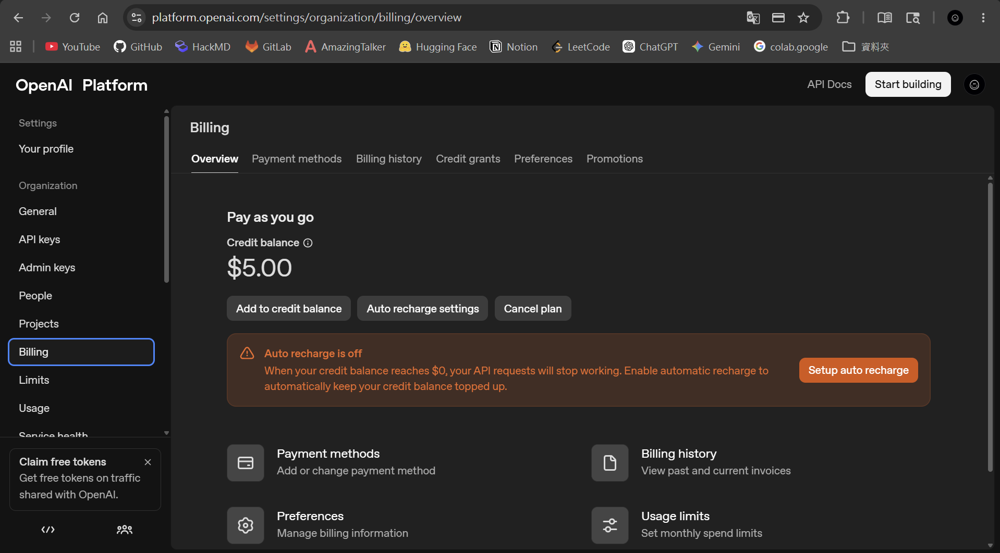

### 7.3 PayPal 金流 ⚠ 未實作

本次未串接真實 PayPal 金流,改用「示範付款」按鈕完成訂單建立 + 寄信流程。

### 7.4 iCal 多平台日曆同步 ⚠ 未實作

本次未實作 Airbnb / Booking.com 日曆同步。

---

## 八、向量資料庫 (RAG) 詳解 ★

這是本專案最有資料庫深度的部分,結合了 **PostgreSQL + pgvector + 自訂 PL/pgSQL 函式 + OpenAI Embeddings**。

在 Table Editor 也能直接驗證 RAG 資料是否成功寫入(回顧 §5.2 的截圖):


### 8.1 為什麼需要 RAG?

如果直接把使用者問題丟給 GPT-4o-mini,GPT 只會根據它「訓練資料裡記得的東西」回答 — 但 GPT 根本不知道 Moment Chalet 的早餐時間是 7:30、入住是 15:00、Chalet D 不提供早餐這些 specific 資料。

**RAG (Retrieval-Augmented Generation)** = 不要讓 AI 用記憶回答,而是先從你的知識庫「檢索」相關段落,把段落塞給 AI 當作 context,AI 才根據實際資料回答。

### 8.2 知識庫內容

我在 [`scripts/seed-rag.mjs`](scripts/seed-rag.mjs) 裡準備了 15 筆文件,涵蓋:

| Category | 標題 |
|----------|------|
| policy | 入住與退房時間、取消與退款政策、寵物與兒童政策、付款方式與發票 |
| facility | 早餐供應與選項、客房內設施、停車場 |
| area | 白馬八方尾根 / 岩岳 / 五竜 滑雪場、推薦餐廳、夏季活動 |
| transport | 從東京前往白馬村、長野站接駁服務 |
| support | 24 小時緊急聯絡 |

每筆會被切成「chunk」(雖然示範因為內容短沒實際切),然後用 OpenAI `text-embedding-3-small` 模型轉成 1536 維的向量,寫入 `documents.embedding` 欄位。

### 8.3 完整 RAG 流程

```
旅客問:「我可以帶狗嗎?」
    ↓
[Step 1] OpenAI Embeddings API
    POST https://api.openai.com/v1/embeddings
    { model: 'text-embedding-3-small', input: '我可以帶狗嗎?' }
    → [0.0123, -0.0456, ..., 0.0089]   (1536 維向量)
    ↓
[Step 2] 餘弦相似度搜尋(在 PostgreSQL 裡)
    SELECT * FROM match_documents(
      query_embedding := [0.0123, -0.0456, ...],
      match_threshold := 0.65,
      match_count     := 4
    );
    → 回 4 筆最相似的文件,例如「寵物與兒童政策」、「客房內設施」、...
    ↓
[Step 3] 組裝 System Prompt
    你是 Moment Chalet Hakuba 的客服助理。
    以下是從知識庫找到的相關資訊,請優先據此回答:

    [1] 寵物與兒童政策
    目前所有 Moment Chalet Hakuba 民宿均不接受寵物入住...

    [2] 客房內設施
    全館提供免費 WiFi、暖氣...
    ↓
[Step 4] OpenAI Chat Completion
    POST https://api.openai.com/v1/chat/completions
    { model: 'gpt-4o-mini', messages: [...] }
    → "很抱歉,目前所有民宿均不接受寵物入住..."
    ↓
[Step 5] 寫入 chat_logs + llm_usage_snapshots(用量計費)
    ↓
回應旅客
```

### 8.4 SQL 核心 — `match_documents` 函式

§4.4 已附完整 SQL,這裡再強調幾個細節:

- **`<=>` 運算子**:pgvector 提供的 cosine distance,範圍 [0, 2]
- **IVFFlat 索引**:把向量空間分 100 個 cluster(`WITH (lists = 100)`),搜尋時只在最近的幾個 cluster 內比對,效能從 O(n) → O(√n)
- **WHERE + ORDER BY 同時用 distance**:`WHERE 1 - distance > threshold` 過濾相似度太低的,`ORDER BY distance ASC` 由近到遠排
- **PL/pgSQL 包裝**:讓前端 / Edge Function 透過 `supabase.rpc()` 一行調用,避免每次都拼複雜 SQL

---

## 九、安全機制

### 9.1 三把 Key 的職責分工

| Key | 何處 | 權限 | 風險 |
|-----|------|------|------|
| `anon` (publishable) | 前端 bundle | 受 RLS 限制 | 故意公開的,設計上假設全世界都看得到 |
| `service_role` | Node 腳本 + Edge Function | 上帝權限,繞過所有 RLS | 絕對不能放前端 |
| `SUPABASE_ACCESS_TOKEN` (sbp_) | Supabase CLI | 操作專案管理 API | 不可外洩 |

**設計上的隔離:** Vite 構建時只把 `VITE_*` 開頭的環境變數注入前端 bundle。我的 `.env` 裡 `SUPABASE_SERVICE_ROLE_KEY=...` 沒有 `VITE_` 前綴,所以 service role 絕對不會跑進前端 JS bundle,即使旅客打開瀏覽器 DevTools 也找不到。

### 9.2 Row Level Security 詳解

RLS 是 PostgreSQL 的列級權限控制 — **每個 SQL 查詢都會被 policy filter 一次**。簡單說:

```sql
-- 沒 RLS,任何人 SELECT 都看到全部
SELECT * FROM bookings;  → 看到 1000 筆訂單

-- 啟用 RLS 後,沒 policy 對應 = 看不到任何東西
SELECT * FROM bookings;  → 看到 0 筆(被 RLS 擋光)

-- 加上 policy 後
CREATE POLICY "anyone can read their booking" ON bookings
  FOR SELECT USING (true);
SELECT * FROM bookings;  → 看到 1000 筆(policy 允許)

-- 但若 policy 是
CREATE POLICY "..." ON bookings
  FOR SELECT USING (auth.uid() = user_id);
SELECT * FROM bookings;  → 只看到自己的訂單(自動 filter)
```

本專案的策略:

- `properties` / `room_types`:**公開讀,authenticated 才能寫**(後台 admin 可改)
- `bookings`:**任何人可 INSERT、任何人可 SELECT**(因為旅客是 guest checkout,不登入)、**authenticated 才能 ALL**(admin 退款 update)
- `chat_logs` / `llm_usage_snapshots`:**只有 admin 看得到**(隱私資料)

旅客如果想「窮舉所有人訂單」(理論上 SELECT 政策是 true),也做不到 — 因為前端只暴露「Email + 訂單 ID」查詢介面,訂單 ID 是 UUID 不能猜。

### 9.3 JWT 驗證 (Edge Function)

所有 `/functions/v1/*` 預設要求 HTTP header `Authorization: Bearer <anon_key>` 才會放行。沒帶就回 401,擋掉路人亂打。

### 9.4 CHECK Constraints — 應用層 + DB 層雙保險

即使前端有驗證,DB 層也加 CHECK:

```sql
CHECK (status IN ('pending', 'confirmed', 'cancelled', 'refunded'))
CONSTRAINT check_dates CHECK (check_out > check_in)
CONSTRAINT check_blocked_dates CHECK (end_date >= start_date)
```

前端可以被繞過(curl 直接打 API),DB 層擋住才是真擋住。

### 9.5 `.gitignore` + 密鑰管理

```
.env
.env.local
.env.*.local
.env.production
.env.test
```

所有 `.env*` 都在 `.gitignore` 裡,git 推不上去。`.env.example` 提供 template 給其他開發者參考。

---

## 十、監控方案

| 工具 | 看什麼 |
|------|--------|
| **Supabase Dashboard → Home** | 整體 Database / Auth / Storage / Realtime 請求量(下方 [圖片 23]) |
| **Supabase Dashboard → Edge Functions → Logs** | 每次 chat / email-send / paypal-* 呼叫的 HTTP status、執行時間、`console.log` 輸出、錯誤 stack trace(下方 [圖片 27]) |
| **Supabase Dashboard → Logs → API** | 所有打 REST API 的請求(SELECT / INSERT / UPDATE / DELETE),含 latency |
| **Supabase Dashboard → Reports** | DB connections、CPU、Memory、Bandwidth 趨勢圖 |
| **Resend Dashboard → Logs** | 每封信件投遞狀態(Delivered / Bounced / Complained)、SMTP 對話紀錄([圖片 20]) |
| **OpenAI Dashboard → Usage** | 每天 token 用量、費用累積 |
| **後台 `/admin/chatbot`(我自建)** | 把 LLM 用量 + 對話紀錄整合呈現 — 從 `llm_usage_snapshots` 和 `chat_logs` 表撈出來([圖片 1, 2]) |
| **後台 `/admin`(Dashboard)** | 收入 / 支出 / 入住率 / 各民宿表現等業務指標([圖片 6, 8]) |

下圖是 **Supabase Dashboard 首頁** 的「Last 60 minutes」總請求量圖 — 顯示過去 1 小時內有 76 個請求(其中 Database 71 個、Auth 4 個、Storage 1 個),可以快速判斷系統是否被攻擊或異常流量:

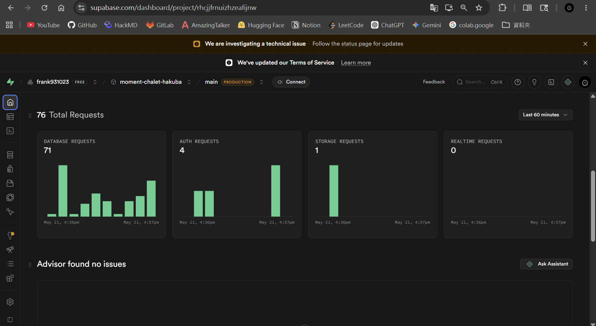

更細的 Edge Function 監控:每個 function 有獨立的 **執行時間** 與 **invocations** 圖表,可以看到每次呼叫的平均 / 最大時間、成功 / 失敗比例。下圖是 `chat` function 的監控頁,可以看到過去 1 小時平均執行時間 191.12 ms、最大 5,939 ms(那次可能 OpenAI 拖慢),呼叫次數圖以顏色區分 2xx / 4xx / 5xx 狀態:

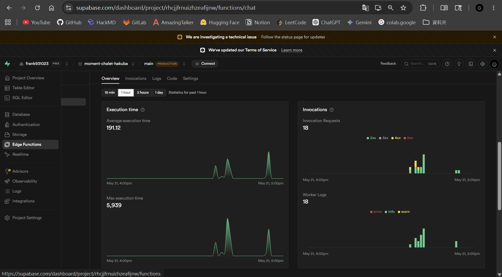

所有監控其實都是 **「再多寫一些 SQL SELECT」** — `llm_usage_snapshots` 表本身就是設計來給後台分析用的。例如「本月 Token 用量」就是:

```sql
SELECT SUM(tokens_input + tokens_output) AS monthly_tokens
FROM llm_usage_snapshots
WHERE created_at >= DATE_TRUNC('month', NOW());
```

---

## 十一、備份邏輯

### 11.1 Supabase 自動備份

Supabase 對所有專案做 **Daily 自動備份**(免費版保留 7 天,Pro 版保留 30 天)。任何災難情況下都可以從 Dashboard → Database → Backups 一鍵還原到某天的快照。

### 11.2 Migration 版本控制

每個 schema 變更都是一個獨立 .sql 檔(`001_*.sql` ~ `005_*.sql`),全部 commit 進 git。新環境(例如老師要 demo 用新 Supabase 專案)只要依序套用這 5 個檔就能重建完整 schema — DDL 是純文字,git 永遠可追溯。

### 11.3 Seed 腳本

`scripts/seed.mjs` 和 `scripts/seed-rag.mjs` 是**程式碼即資料**的設計 — 整個示範資料集都用 Node.js 程式產生並插入。任何時候資料被搞壞,重跑一次腳本就能還原到一個已知的乾淨狀態。腳本本身是 idempotent(冪等),會先 DELETE 再 INSERT,重跑結果一致。

### 11.4 完整還原劇本

如果今天 Supabase 整個專案掛掉,要在新專案重建完整系統,只需:

```bash
# 1. 新建 Supabase 專案,取得新 URL + keys 填入 .env
# 2. SQL Editor 依序執行 5 個 migration
# 3. 寫入示範資料
node scripts/seed.mjs
node scripts/seed-rag.mjs
# 4. 建立後台 admin
node scripts/create-admin.mjs admin@chalet.com password
# 5. 部署 Edge Function
node scripts/deploy-functions.mjs
```

整套流程 ~ 10 分鐘可重建。

---

## 十二、開發流程與部署

### 12.1 自動化腳本一覽

| 腳本 | 用途 |
|------|------|
| `scripts/seed.mjs` | 注入 9 民宿 + 27 房型 + 5 訂單 + 3 封鎖日期 |
| `scripts/seed-rag.mjs` | 注入 15 筆 RAG 文本 + 自動算 embedding |
| `scripts/create-admin.mjs` | 一行建立後台 admin 帳號 |
| `scripts/deploy-functions.mjs` | 一鍵推 secrets + 部署所有 Edge Function |
| `scripts/test-email.mjs` | 一鍵測試 email-send function |

把人類會做的重複動作 codify 成腳本,既快又不會出錯。

### 12.2 Tech Stack 整理

| 層 | 技術 |
|----|------|
| **資料庫** | PostgreSQL 17 + pgvector |
| **BaaS** | Supabase(Auth / Storage / Edge Functions) |
| **前端** | Vue 3 + Vite + TypeScript + Pinia + Vue Router |
| **UI** | Tailwind CSS + PrimeVue 4 + Leaflet(地圖)+ v-calendar(日曆) |
| **i18n** | vue-i18n(zh-TW / en / ja) |
| **後端** | Supabase Edge Functions (Deno + TypeScript) |
| **金流** | PayPal Orders API(示範模式可跳過) |
| **Email** | Resend(已驗證網域 yourpasswordiswrong.com) |
| **AI** | OpenAI text-embedding-3-small(向量化) + gpt-4o-mini(對話) |
| **測試** | Vitest + fast-check(屬性測試)+ Playwright(E2E) |

---

## 十三、未來工作

本次專題以「資料庫操作」為主軸,部分週邊整合留作未來擴充。已經完成的 DB schema 與 UI 框架讓這些功能將來只要補上 API 串接即可啟用。

### 13.1 PayPal 真實金流

目前以「示範付款」按鈕模擬訂單建立流程,DB 寫入與 email 發送已完整運作。未來補上:

1. 在 PayPal Developer Dashboard 建立 Business + Personal Sandbox Account
2. 申請 Merchant ID、設定 webhook URL 接收 `PAYMENT.CAPTURE.COMPLETED` 等事件
3. 把 `VITE_PAYPAL_CLIENT_ID` 與 `PAYPAL_CLIENT_SECRET` 填入 `.env`
4. 部署既有的 `paypal-create-order` / `paypal-capture-order` / `paypal-refund` 三個 Edge Function(程式碼已寫好)

預估 1–2 天工作量。

### 13.2 iCal 多平台日曆同步

`blocked_dates` 表、後台 `/admin/ical` UI、`ical-sync` Edge Function 都已備好,只差兩件事:

1. 把民宿主在 Airbnb / Booking.com 後台匯出的 iCal URL 填入 `properties.ical_url` 欄位
2. 透過 Supabase 的 `pg_cron` 擴充每小時排程觸發 `ical-sync` function

完成後即可避免「同一晚被 Airbnb 與本站同時訂走」的雙重預訂風險。

### 13.3 其他可能擴充

- **Supabase Storage 圖片上傳**:目前民宿圖用 placehold.co,可改用 Storage bucket 讓 admin 後台上傳真實照片
- **DB triggers**:可寫 `AFTER INSERT ON bookings` trigger 自動觸發發送通知(目前在前端手動 invoke email-send)
- **更細的 RLS**:`bookings` 表的 SELECT 政策目前是 `USING (true)`(任何人都能讀),可改成需要 email 匹配的 row 才能讀,進一步降低洩漏風險
- **pg_cron** 自動化:每月 1 日自動執行 `INSERT INTO monthly_summaries SELECT ...` 把上月統計快照存下來

## 十四、結論

### 14.1 達成項目

對照課程要求「方向 A:系統開發實作型」:

| 要求 | 對應章節 |
|------|----------|
| 開發具備互動介面的系統 | §六 介面功能盤點(共 18 張截圖) |
| 盤點介面功能 | §六(旅客端 + 後台兩大區共 13 個功能頁) |
| 列出對應的資料庫表結構 | §三 資料庫設計(7 張表 + CREATE TABLE SQL) |
| 詳列所使用的 SQL 語句 | §四 SQL 操作詳列(SELECT/INSERT/UPDATE/JOIN/RPC/RLS) |
| 展示系統的安全機制 | §九 安全機制(三把 Key + RLS + JWT + CHECK Constraints) |
| 監控方案 | §十 監控方案(7 種監控管道) |
| 備份邏輯 | §十一 備份邏輯(自動備份 + Migration + Seed 腳本) |

### 14.2 本專案的資料庫深度

- ✓ 7 張關聯表,完整外鍵約束、CHECK 約束、UNIQUE 索引
- ✓ 完整 Row Level Security 策略涵蓋所有表
- ✓ pgvector 擴充 + IVFFlat 向量索引 + cosine similarity 搜尋
- ✓ 自訂 PL/pgSQL 函式 `match_documents` 供 RAG 使用
- ✓ Migration 版本控制(5 個有版號的 .sql 檔)
- ✓ 多表 JOIN 查詢(訂單 + 房型 + 民宿)
- ✓ PostgreSQL 原生陣列型別 (TEXT[]) 與 JSONB 應用
- ✓ 樂觀鎖(`WHERE status = 'confirmed'`)防止重複退款

### 14.3 心得

這次最大的收穫是**把資料庫當成系統的單一真相來源(Single Source of Truth)** — 所有業務邏輯最終都落在那 7 張表上,RLS 保證資料只能被該看到的人看到,CHECK 保證資料一定符合 invariant。這讓系統有非常清楚的 mental model:**只要 DB 的 state 對,系統就對。**

pgvector 讓 RAG 變得「不需要另外架向量資料庫(Pinecone / Weaviate)」 — 同一個 PostgreSQL 既存業務資料也存 embedding,JOIN 一下就能拿到 chunk 內容,大幅降低運維複雜度。對於不到百萬筆文件的中小型應用,這是最划算的選擇。

Supabase 的 Table Editor 與 SQL Editor 大幅縮短開發 iteration 時間 — schema 改一改,SQL Editor 跑一下,Table Editor 看一眼資料,3 分鐘可以驗證一個 hypothesis。比起傳統「寫 migration → 本機 down → up → 用 psql 驗證」的流程快 10 倍。

整個專案從零到完整 demo 約 2 週,過程中對「資料庫設計決策如何影響業務彈性」、「RLS 如何讓 multi-tenant 安全變便宜」、「向量搜尋為什麼能放進 PostgreSQL」都有比上課單純看 slides 更深的體會。

---

## 附錄 A:倉庫結構

```
new_project/
├── README.md                     ← 使用說明
├── REPORT.md                     ← 本報告
├── package.json                  ← 前端依賴
├── vite.config.ts
├── .env.example                  ← 環境變數範本
├── src/                          ← 前端
│   ├── main.ts
│   ├── App.vue
│   ├── components/               ← Navbar / RoomCard / ChatbotWidget / PayPalButton ...
│   ├── views/                    ← Home / Properties / Booking / MyBooking / admin/*
│   ├── stores/                   ← Pinia: auth, property, booking, chat
│   ├── router/                   ← Vue Router 設定 + admin route guard
│   ├── layouts/AdminLayout.vue
│   ├── locales/                  ← zh-TW.json, en.json, ja.json
│   ├── lib/supabase.ts           ← Supabase client init
│   └── types/index.ts            ← TypeScript 型別
├── supabase/
│   ├── migrations/               ← 5 個 SQL migration
│   │   ├── 001_initial_schema.sql
│   │   ├── 002_auxiliary_tables.sql
│   │   ├── 003_rls_and_indexes.sql
│   │   ├── 004_rag_documents.sql
│   │   └── 005_public_booking_access.sql
│   ├── functions/                ← 8 個 Edge Function
│   │   ├── bookings/, chat/, documents/, email-send/
│   │   ├── ical-sync/
│   │   └── paypal-create-order/, paypal-capture-order/, paypal-refund/
│   └── seed.sql
├── scripts/                      ← 自動化腳本
│   ├── seed.mjs                  ← 注入示範資料
│   ├── seed-rag.mjs              ← 注入 RAG 知識庫
│   ├── create-admin.mjs          ← 建立 admin
│   ├── deploy-functions.mjs      ← 一鍵部署 Edge Function
│   └── test-email.mjs            ← 測試寄信
├── e2e/                          ← Playwright E2E 測試
└── images/                       ← 本報告引用的截圖
```

## 附錄 B:重要 SQL 完整清單

完整版見 `supabase/migrations/` 目錄下五個檔案。本報告 §三、§四 已摘錄關鍵 SQL。
